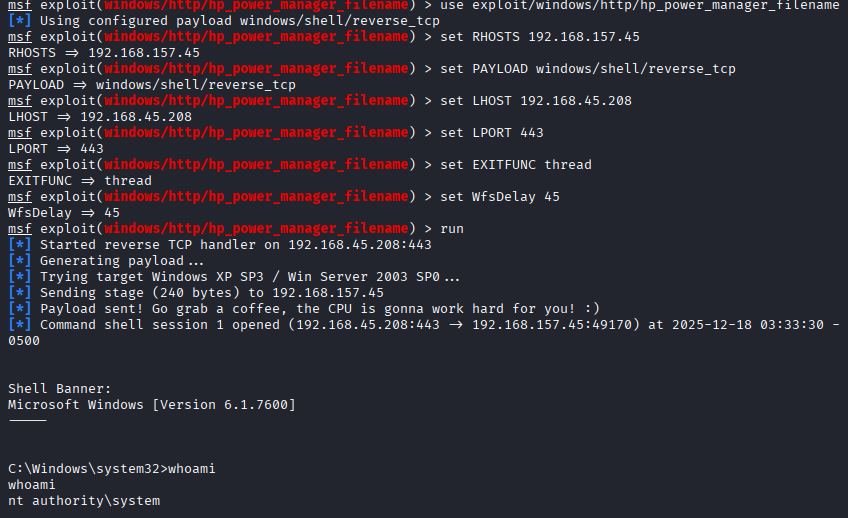

# Kevin 

## Enumeration

```
──(kali㉿kali)-[~/Desktop/Offsec/Lab-Notes/Kevin]
└─$ nmap -sCV -Pn -A -T4 192.168.157.45 -o nmapscan.txt
Starting Nmap 7.95 ( https://nmap.org ) at 2025-12-18 02:30 EST
Nmap scan report for 192.168.157.45
Host is up (0.066s latency).
Not shown: 989 closed tcp ports (reset)
PORT      STATE SERVICE      VERSION
80/tcp    open  http         GoAhead WebServer
|_http-server-header: GoAhead-Webs
| http-title: HP Power Manager
|_Requested resource was http://192.168.157.45/index.asp
135/tcp   open  msrpc        Microsoft Windows RPC
139/tcp   open  netbios-ssn  Microsoft Windows netbios-ssn
445/tcp   open  microsoft-ds Windows 7 Ultimate N 7600 microsoft-ds (workgroup: WORKGROUP)
3389/tcp  open  tcpwrapped
| ssl-cert: Subject: commonName=kevin
| Not valid before: 2025-12-17T07:28:45
|_Not valid after:  2026-06-18T07:28:45
| rdp-ntlm-info: 
|   Target_Name: KEVIN
|   NetBIOS_Domain_Name: KEVIN
|   NetBIOS_Computer_Name: KEVIN
|   DNS_Domain_Name: kevin
|   DNS_Computer_Name: kevin
|   Product_Version: 6.1.7600
|_  System_Time: 2025-12-18T07:31:44+00:00
|_ssl-date: 2025-12-18T07:31:59+00:00; +2s from scanner time.
49152/tcp open  msrpc        Microsoft Windows RPC
49153/tcp open  msrpc        Microsoft Windows RPC
49154/tcp open  msrpc        Microsoft Windows RPC
49155/tcp open  msrpc        Microsoft Windows RPC
49158/tcp open  msrpc        Microsoft Windows RPC
49159/tcp open  msrpc        Microsoft Windows RPC


```

* web server is running HP Power Manager 4.2.

* Its vulnerable to Universal Buffer Overflow CVE:2009-2685.

## Exploitation


