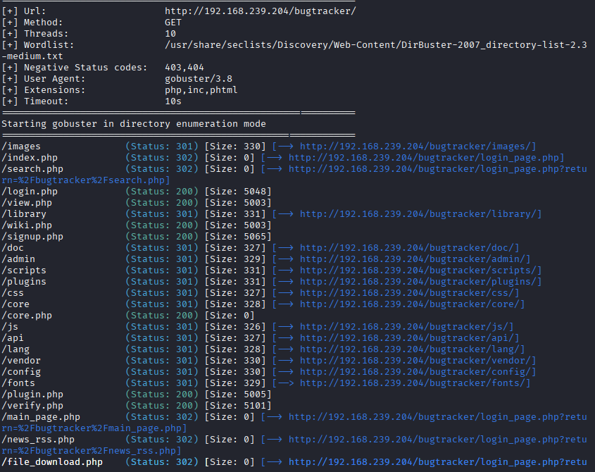
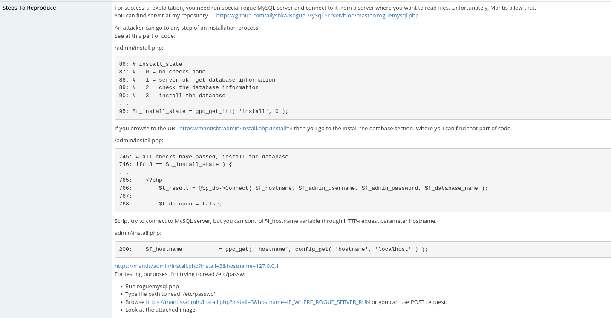
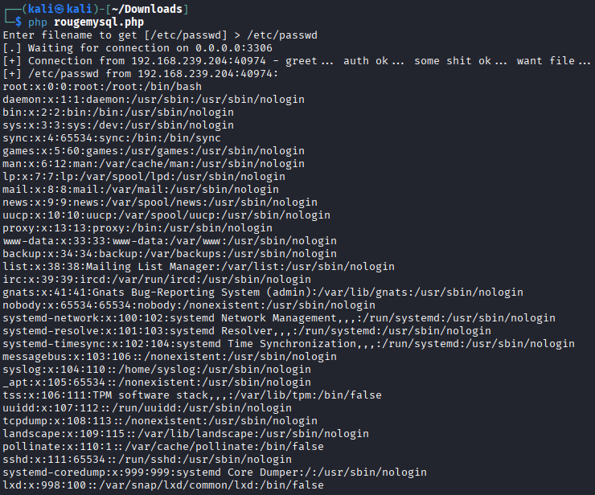
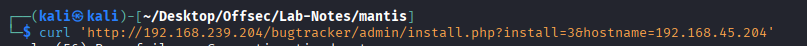
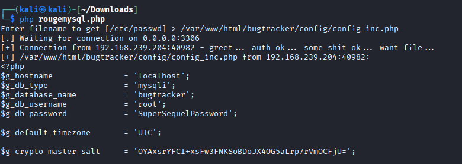
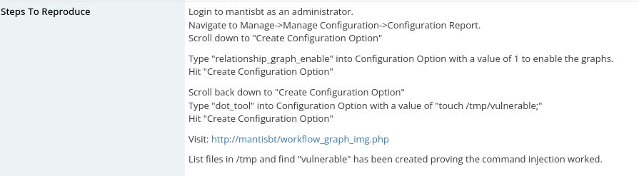
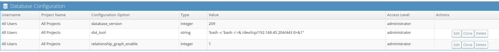
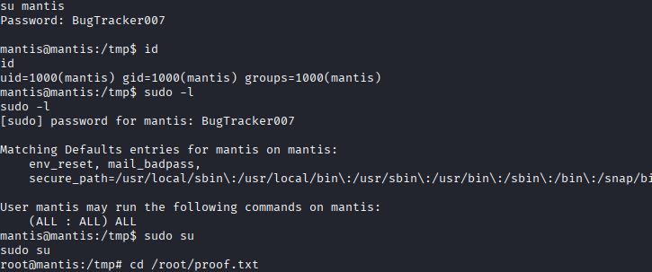

# Mantis - Linux

* nmap

```
┌──(kali㉿kali)-[~/Desktop/Offsec/Lab-Notes/mantis]
└─$ nmap -sCV -Pn -A -T4 -p- 192.168.239.204
Starting Nmap 7.95 ( https://nmap.org ) at 2026-01-15 03:28 EST
Nmap scan report for 192.168.239.204
Host is up (0.070s latency).
Not shown: 65533 filtered tcp ports (no-response)
PORT     STATE SERVICE VERSION
80/tcp   open  http    Apache httpd 2.4.41 ((Ubuntu))
|_http-title: Slick - Bootstrap 4 Template
|_http-server-header: Apache/2.4.41 (Ubuntu)
3306/tcp open  mysql   MariaDB 5.5.5-10.3.34
| mysql-info: 
|   Protocol: 10
|   Version: 5.5.5-10.3.34-MariaDB-0ubuntu0.20.04.1
|   Thread ID: 16
|   Capabilities flags: 63486
|   Some Capabilities: LongColumnFlag, SupportsCompression, Support41Auth, Speaks41ProtocolOld, IgnoreSigpipes, FoundRows, ConnectWithDatabase, SupportsTransactions, ODBCClient, InteractiveClient, DontAllowDatabaseTableColumn, Speaks41ProtocolNew, SupportsLoadDataLocal, IgnoreSpaceBeforeParenthesis, SupportsMultipleResults, SupportsMultipleStatments, SupportsAuthPlugins
|   Status: Autocommit
|   Salt: HO1HUU*pv~:D%,L{I:'Q
|_  Auth Plugin Name: mysql_native_password

```

* Port 80 -> static Slick template page.

* Gobuster enumeration reveals /bugtracker endpoint. 

* It is login page to mantis bug tracker application. Its shows a warning that admin directory is listed and accessible.

* Gobuster enumeration:




* in /admin we get install.php

* in /bugtracker/config/ we have config_inc.php file which is application's database config file. 

Exploit: https://bugzilla.redhat.com/show_bug.cgi?id=1483617

* https://mantisbt.org/bugs/view.php?id=23173 - CVE-2017-12419: Arbitrary File Read inside install.php script



           



* So we get config_inc.php file to get mysql creds.

   

* We get creds. Login to mysql, from the users table get administrators hash. Crack it. (md5)
```
 hashcat -m 0 c7870d0b102cfb2f4916ff04e47b5c6f /usr/share/wordlists/rockyou.txt 
 ```
 
 * Administrator:prayingmantis
 
 * Login to Matis BT application. 
 
 * Version is 2.5.2 . 
 
 * To get shell -> exploit : https://mantisbt.org/bugs/view.php?id=26091
                      
 

 


* we get connection as www-data.

* Priv Esc -> run pspy

```
2026/01/15 11:00:01 CMD: UID=1000  PID=8110   | 
2026/01/15 11:00:01 CMD: UID=1000  PID=8111   | 
2026/01/15 11:00:01 CMD: UID=1000  PID=8112   | mysqldump -u bugtracker -pBugTracker007 bugtracker 
```

* we have user mantis running mysqldump cmd with creds.

* su to mantis.

* sudo -l -> sudo su to get root

 
