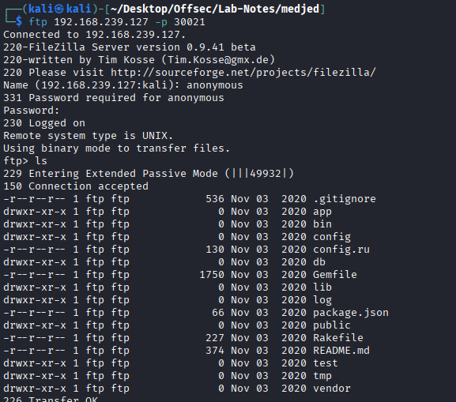
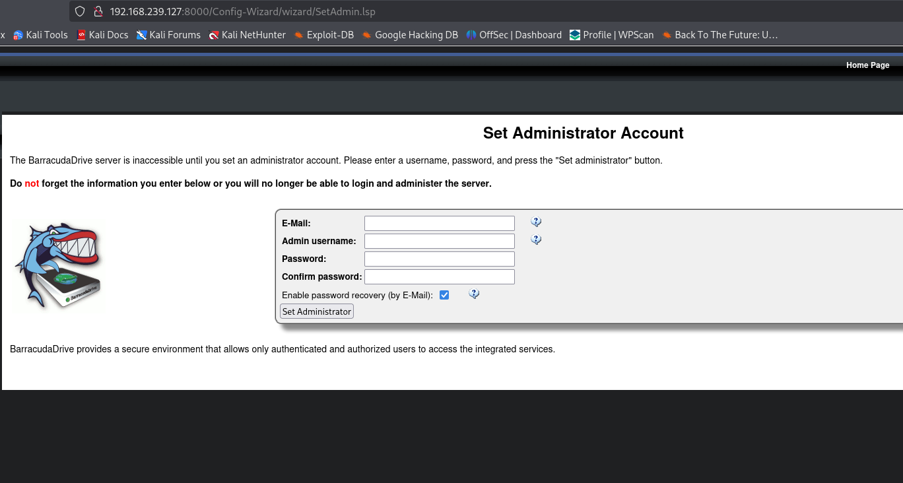
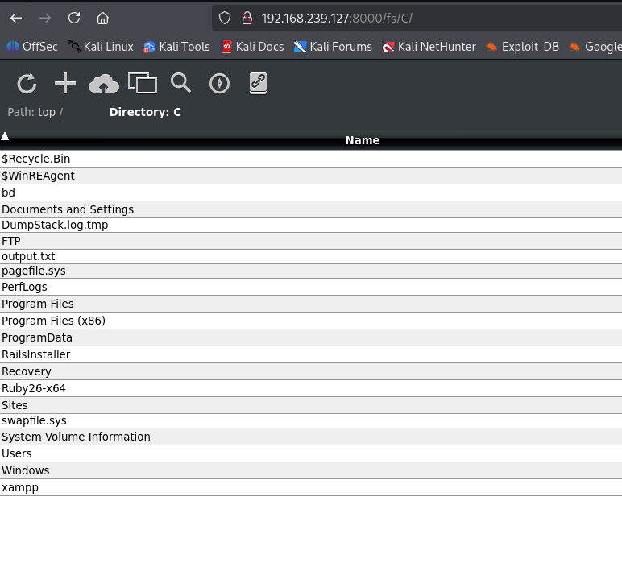
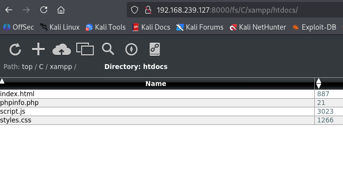
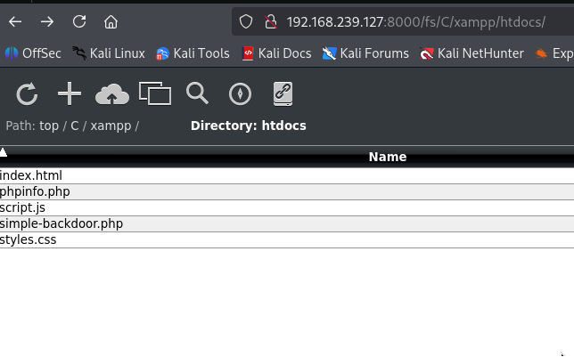
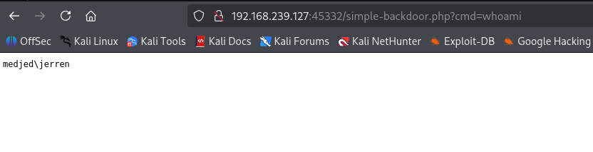
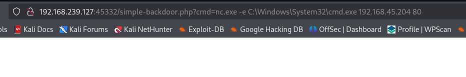
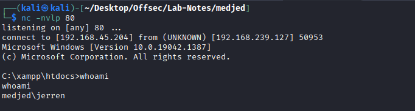
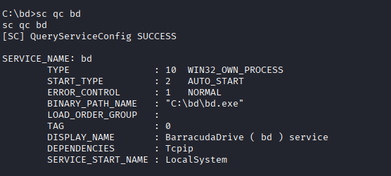

# MedJed - windows


* nmap

```
┌──(kali㉿kali)-[~/Desktop/Offsec/Lab-Notes/medjed]
└─$ nmap -sCV -Pn -A -T4 -p- 192.168.239.127
Starting Nmap 7.95 ( https://nmap.org ) at 2026-01-14 23:12 EST
Nmap scan report for 192.168.239.127
Host is up (0.091s latency).
Not shown: 65517 closed tcp ports (reset)
PORT      STATE SERVICE       VERSION
135/tcp   open  msrpc         Microsoft Windows RPC
139/tcp   open  netbios-ssn   Microsoft Windows netbios-ssn
445/tcp   open  microsoft-ds?
3306/tcp  open  mysql         MariaDB 10.3.24 or later (unauthorized)
5040/tcp  open  unknown
7680/tcp  open  pando-pub?
8000/tcp  open  http-alt      BarracudaServer.com (Windows)
| http-methods: 
|_  Potentially risky methods: PROPFIND PUT COPY DELETE MOVE MKCOL PROPPATCH LOCK UNLOCK
| fingerprint-strings: 
|   FourOhFourRequest, Socks5: 
|     HTTP/1.1 200 OK
|     Date: Thu, 15 Jan 2026 04:13:51 GMT
|     Server: BarracudaServer.com (Windows)
|     Connection: Close
|   GenericLines: 
|     HTTP/1.1 200 OK
|     Date: Thu, 15 Jan 2026 04:13:45 GMT
|     Server: BarracudaServer.com (Windows)
|     Connection: Close
|   GetRequest: 
|     HTTP/1.1 200 OK
|     Date: Thu, 15 Jan 2026 04:13:46 GMT
|     Server: BarracudaServer.com (Windows)
|     Connection: Close
|   HTTPOptions, RTSPRequest: 
|     HTTP/1.1 200 OK
|     Date: Thu, 15 Jan 2026 04:13:56 GMT
|     Server: BarracudaServer.com (Windows)
|     Connection: Close
|   SIPOptions: 
|     HTTP/1.1 400 Bad Request
|     Date: Thu, 15 Jan 2026 04:15:01 GMT
|     Server: BarracudaServer.com (Windows)
|     Connection: Close
|     Content-Type: text/html
|     Cache-Control: no-store, no-cache, must-revalidate, max-age=0
|_    <html><body><h1>400 Bad Request</h1>Can't parse request<p>BarracudaServer.com (Windows)</p></body></html>
|_http-server-header: BarracudaServer.com (Windows)
|_http-open-proxy: Proxy might be redirecting requests
| http-webdav-scan: 
|   Allowed Methods: OPTIONS, GET, HEAD, PROPFIND, PUT, COPY, DELETE, MOVE, MKCOL, PROPFIND, PROPPATCH, LOCK, UNLOCK
|   Server Date: Thu, 15 Jan 2026 04:16:33 GMT
|   Server Type: BarracudaServer.com (Windows)
|_  WebDAV type: Unknown
|_http-title: Home
30021/tcp open  ftp           FileZilla ftpd 0.9.41 beta
|_ftp-bounce: bounce working!
| ftp-anon: Anonymous FTP login allowed (FTP code 230)
| -r--r--r-- 1 ftp ftp            536 Nov 03  2020 .gitignore
| drwxr-xr-x 1 ftp ftp              0 Nov 03  2020 app
| drwxr-xr-x 1 ftp ftp              0 Nov 03  2020 bin
| drwxr-xr-x 1 ftp ftp              0 Nov 03  2020 config
| -r--r--r-- 1 ftp ftp            130 Nov 03  2020 config.ru
| drwxr-xr-x 1 ftp ftp              0 Nov 03  2020 db
| -r--r--r-- 1 ftp ftp           1750 Nov 03  2020 Gemfile
| drwxr-xr-x 1 ftp ftp              0 Nov 03  2020 lib
| drwxr-xr-x 1 ftp ftp              0 Nov 03  2020 log
| -r--r--r-- 1 ftp ftp             66 Nov 03  2020 package.json
| drwxr-xr-x 1 ftp ftp              0 Nov 03  2020 public
| -r--r--r-- 1 ftp ftp            227 Nov 03  2020 Rakefile
| -r--r--r-- 1 ftp ftp            374 Nov 03  2020 README.md
| drwxr-xr-x 1 ftp ftp              0 Nov 03  2020 test
| drwxr-xr-x 1 ftp ftp              0 Nov 03  2020 tmp
|_drwxr-xr-x 1 ftp ftp              0 Nov 03  2020 vendor
| ftp-syst: 
|_  SYST: UNIX emulated by FileZilla
33033/tcp open  unknown
| fingerprint-strings: 
|   GenericLines: 
|     HTTP/1.1 400 Bad Request
|   GetRequest, HTTPOptions: 
|     HTTP/1.0 403 Forbidden
|     Content-Type: text/html; charset=UTF-8
|     Content-Length: 3102
|     <!DOCTYPE html>
|     <html lang="en">
|     <head>
|     <meta charset="utf-8" />
|     <title>Action Controller: Exception caught</title>
|     <style>
|     body {
|     background-color: #FAFAFA;
|     color: #333;
|     margin: 0px;
|     body, p, ol, ul, td {
|     font-family: helvetica, verdana, arial, sans-serif;
|     font-size: 13px;
|     line-height: 18px;
|     font-size: 11px;
|     white-space: pre-wrap;
|     pre.box {
|     border: 1px solid #EEE;
|     padding: 10px;
|     margin: 0px;
|     width: 958px;
|     header {
|     color: #F0F0F0;
|     background: #C52F24;
|     padding: 0.5em 1.5em;
|     margin: 0.2em 0;
|     line-height: 1.1em;
|     font-size: 2em;
|     color: #C52F24;
|     line-height: 25px;
|     .details {
|_    bord
44330/tcp open  ssl/unknown
| ssl-cert: Subject: commonName=server demo 1024 bits/organizationName=Real Time Logic/stateOrProvinceName=CA/countryName=US
| Not valid before: 2009-08-27T14:40:47
|_Not valid after:  2019-08-25T14:40:47
|_ssl-date: 2026-01-15T04:16:57+00:00; -1s from scanner time.
45332/tcp open  http          Apache httpd 2.4.46 ((Win64) OpenSSL/1.1.1g PHP/7.3.23)
|_http-title: Quiz App
| http-methods: 
|_  Potentially risky methods: TRACE
|_http-server-header: Apache/2.4.46 (Win64) OpenSSL/1.1.1g PHP/7.3.23
45443/tcp open  http          Apache httpd 2.4.46 ((Win64) OpenSSL/1.1.1g PHP/7.3.23)
|_http-title: Quiz App
| http-methods: 
|_  Potentially risky methods: TRACE
|_http-server-header: Apache/2.4.46 (Win64) OpenSSL/1.1.1g PHP/7.3.23
49664/tcp open  msrpc         Microsoft Windows RPC
49665/tcp open  msrpc         Microsoft Windows RPC
49666/tcp open  msrpc         Microsoft Windows RPC
49667/tcp open  msrpc         Microsoft Windows RPC
49668/tcp open  msrpc         Microsoft Windows RPC
49669/tcp open  msrpc         Microsoft Windows RPC
```

* No rpc, smb blind access.

* ftp Anonymous Access



* These is root of ruby application. No imp info.

* 8000 is web file server - BarracudaServer. We are able to change admin passwords upon login.



* We can traverse the application.





* The appication is written in php, upload php cmd shell and test for RCE.





* Upload nc and get as reverse connection.





* Priv Esc -> Baraccuda bd sevice binary hijacking - https://www.exploit-db.com/exploits/48789



* upload bd.exe rev shell payload, restart system , we get admin shell.

