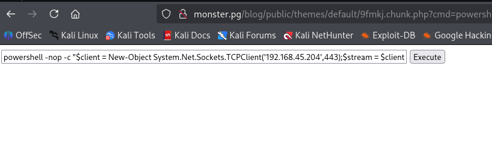
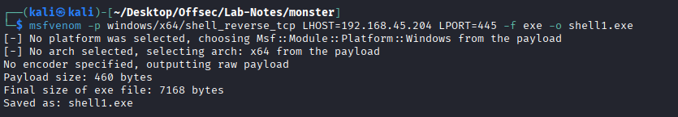
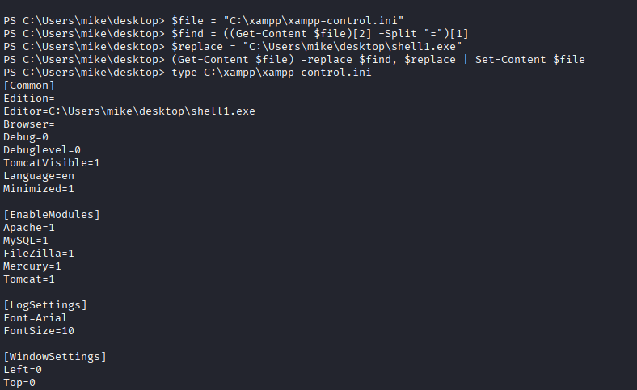
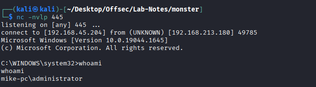

# Monster - windows

* nmap 
```
┌──(kali㉿kali)-[~/Desktop/Offsec/Lab-Notes/monster]
└─$ nmap -sCV -Pn -A -T4 -p- 192.168.213.180 -o nmap.txt
Starting Nmap 7.95 ( https://nmap.org ) at 2026-01-16 03:57 EST
Nmap scan report for 192.168.213.180
Host is up (0.092s latency).
Not shown: 65521 closed tcp ports (reset)
PORT      STATE SERVICE       VERSION
80/tcp    open  http          Apache httpd 2.4.41 ((Win64) OpenSSL/1.1.1c PHP/7.3.10)
|_http-server-header: Apache/2.4.41 (Win64) OpenSSL/1.1.1c PHP/7.3.10
| http-methods: 
|_  Potentially risky methods: TRACE
|_http-title: Mike Wazowski
135/tcp   open  msrpc         Microsoft Windows RPC
139/tcp   open  netbios-ssn   Microsoft Windows netbios-ssn
443/tcp   open  ssl/http      Apache httpd 2.4.41 ((Win64) OpenSSL/1.1.1c PHP/7.3.10)
| tls-alpn: 
|_  http/1.1
| http-methods: 
|_  Potentially risky methods: TRACE
|_http-title: Mike Wazowski
|_ssl-date: TLS randomness does not represent time
| ssl-cert: Subject: commonName=localhost
| Not valid before: 2009-11-10T23:48:47
|_Not valid after:  2019-11-08T23:48:47
|_http-server-header: Apache/2.4.41 (Win64) OpenSSL/1.1.1c PHP/7.3.10
445/tcp   open  microsoft-ds?
3389/tcp  open  ms-wbt-server Microsoft Terminal Services
| ssl-cert: Subject: commonName=Mike-PC
| Not valid before: 2026-01-15T08:53:36
|_Not valid after:  2026-07-17T08:53:36
| rdp-ntlm-info: 
|   Target_Name: MIKE-PC
|   NetBIOS_Domain_Name: MIKE-PC
|   NetBIOS_Computer_Name: MIKE-PC
|   DNS_Domain_Name: Mike-PC
|   DNS_Computer_Name: Mike-PC
|   Product_Version: 10.0.19041
|_  System_Time: 2026-01-16T09:02:03+00:00
|_ssl-date: 2026-01-16T09:02:17+00:00; +1s from scanner time.
5040/tcp  open  unknown
7680/tcp  open  pando-pub?
49664/tcp open  msrpc         Microsoft Windows RPC
49665/tcp open  msrpc         Microsoft Windows RPC
49666/tcp open  msrpc         Microsoft Windows RPC
49667/tcp open  msrpc         Microsoft Windows RPC
49668/tcp open  msrpc         Microsoft Windows RPC
49669/tcp open  msrpc         Microsoft Windows RPC
```

* Gobuster
```
/blog                 (Status: 301) [Size: 342] [--> http://192.168.213.180/blog/]
/assets               (Status: 301) [Size: 344] [--> http://192.168.213.180/assets/]
/Blog                 (Status: 301) [Size: 342] [--> http://192.168.213.180/Blog/]
```

* /blog points us to admin panel - /blog/admin. 
* monstra 3.0.4
* weak creds- we are able to login with admin:wazowski

* Initial Access exploit: https://www.exploit-db.com/exploits/52038

```
┌──(venv)─(kali㉿kali)-[~/Desktop/Offsec/Lab-Notes/monster]
└─$ python3 52038.py http://monster.pg/blog admin wazowski
[*] Logging in...
[+] Login successful
[*] Preparing shell...
[+] Shell ready:
http://monster.pg/blog/public/themes/default/vl7pf.chunk.php
```

* We are able to get RCE. 



* Priv-Esc -> xampp version 7.3.10 (C:\xampp\properties.ini)

exploit -> https://www.exploit-db.com/exploits/50337






