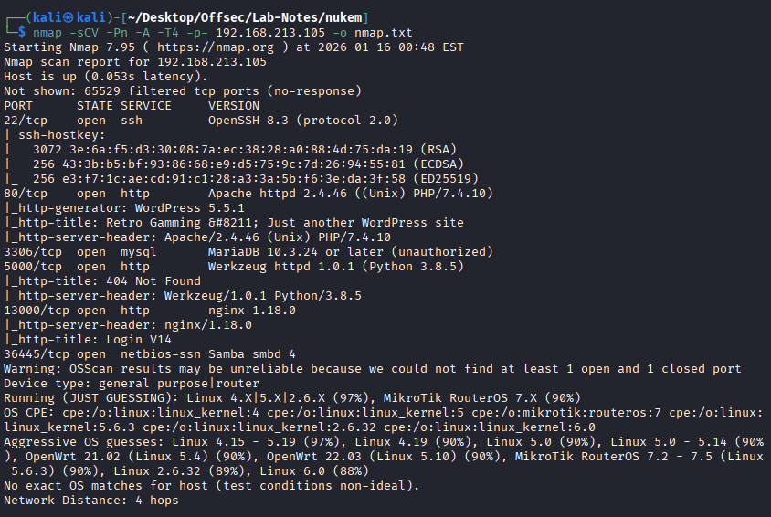
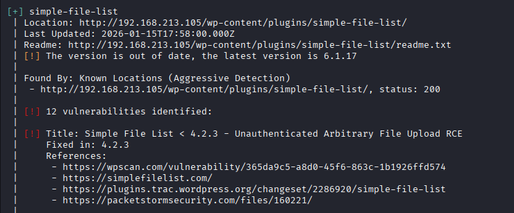
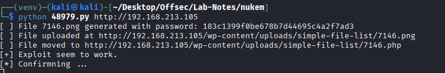
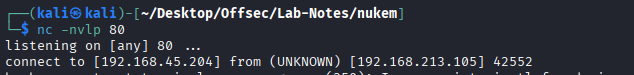
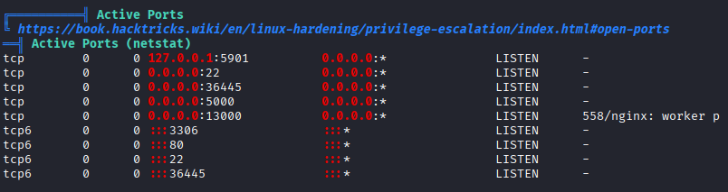
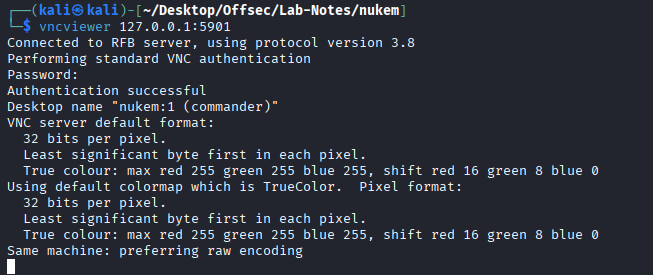
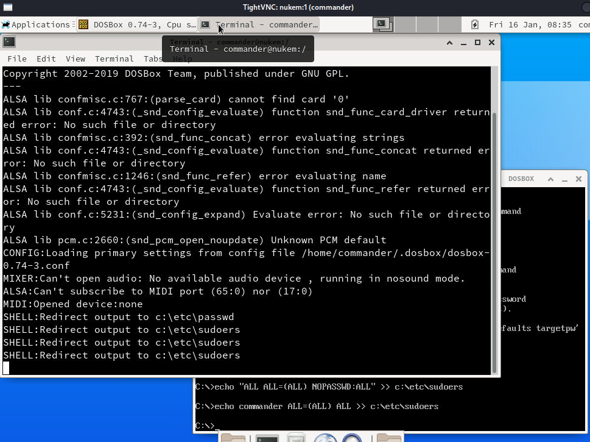
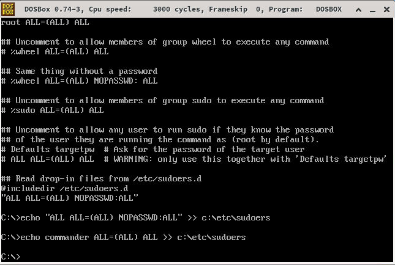
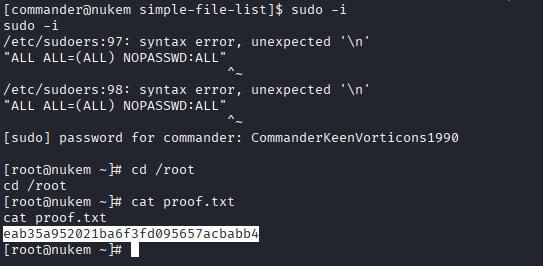

# Nukem

* nmap



* wordpress site . wpscan reveals vulnerable plugin



* exp -> https://www.exploit-db.com/exploits/48979





* linpeas.sh -> reveals db creds

```
define( 'DB_USER', 'commander' );
define( 'DB_PASSWORD', 'CommanderKeenVorticons1990' );
```
* There is also suid set for dosbox -> https://gtfobins.github.io/gtfobins/dosbox/
* We can overwrite /etc/passwd or /etc/sudoers 

* There is internal VNC service running on port 5901



* We use ssh rempte port forwarding to access VNC service from our machine.


* Used db_password.





* Overwrite /etc/sudoers file by allowing root access to everyone.

```
mount c /
c:
```



* sudo su to get root access


 
