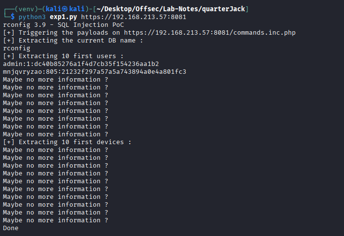
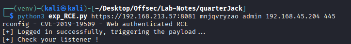
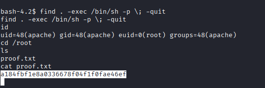

# Quackerjack

* nmap 
```
┌──(kali㉿kali)-[~/Desktop/Offsec/Lab-Notes/quarterJack]
└─$ nmap -sCV -Pn -A -T4 -p- 192.168.213.57 -o nmap.txt
Starting Nmap 7.95 ( https://nmap.org ) at 2026-01-16 08:27 EST
Nmap scan report for 192.168.213.57
Host is up (0.059s latency).
Not shown: 65527 filtered tcp ports (no-response)
PORT     STATE SERVICE     VERSION
21/tcp   open  ftp         vsftpd 3.0.2
| ftp-syst: 
|   STAT: 
| FTP server status:
|      Connected to ::ffff:192.168.45.204
|      Logged in as ftp
|      TYPE: ASCII
|      No session bandwidth limit
|      Session timeout in seconds is 300
|      Control connection is plain text
|      Data connections will be plain text
|      At session startup, client count was 1
|      vsFTPd 3.0.2 - secure, fast, stable
|_End of status
| ftp-anon: Anonymous FTP login allowed (FTP code 230)
|_Can't get directory listing: TIMEOUT
22/tcp   open  ssh         OpenSSH 7.4 (protocol 2.0)
| ssh-hostkey: 
|   2048 a2:ec:75:8d:86:9b:a3:0b:d3:b6:2f:64:04:f9:fd:25 (RSA)
|   256 b6:d2:fd:bb:08:9a:35:02:7b:33:e3:72:5d:dc:64:82 (ECDSA)
|_  256 08:95:d6:60:52:17:3d:03:e4:7d:90:fd:b2:ed:44:86 (ED25519)
80/tcp   open  http        Apache httpd 2.4.6 ((CentOS) OpenSSL/1.0.2k-fips PHP/5.4.16)
| http-methods: 
|_  Potentially risky methods: TRACE
|_http-server-header: Apache/2.4.6 (CentOS) OpenSSL/1.0.2k-fips PHP/5.4.16
|_http-title: Apache HTTP Server Test Page powered by CentOS
111/tcp  open  rpcbind     2-4 (RPC #100000)
| rpcinfo: 
|   program version    port/proto  service
|   100000  2,3,4        111/tcp   rpcbind
|   100000  2,3,4        111/udp   rpcbind
|   100000  3,4          111/tcp6  rpcbind
|_  100000  3,4          111/udp6  rpcbind
139/tcp  open  netbios-ssn Samba smbd 3.X - 4.X (workgroup: SAMBA)
445/tcp  open  netbios-ssn Samba smbd 4.10.4 (workgroup: SAMBA)
3306/tcp open  mysql       MariaDB 10.3.23 or earlier (unauthorized)
8081/tcp open  http        Apache httpd 2.4.6 ((CentOS) OpenSSL/1.0.2k-fips PHP/5.4.16)
|_http-server-header: Apache/2.4.6 (CentOS) OpenSSL/1.0.2k-fips PHP/5.4.16
|_http-title: 400 Bad Request
```

* No ftp listing, blind RPC, SMB Access.

* Port 80 -> default apache centos page.

* Port 8081 -> https -> rconfig network management 3.9.4 console login page 

* Initial Access -> unauthenticated SQL Injection reveals db creds.

* https://github.com/v1k1ngfr/exploits-rconfig/blob/master/rconfig_CVE-2020-10220.py

* website uses tls cert validatation. Add following code after *requests.Session()* to disable tls verivication in py code.
```
request.verify = False
requests.packages.urllib3.disable_warnings()
```



* Cracking hash gives us creds to login to console.
```
hashcat -m 0 21232f297a57a5a743894a0e4a801fc3 /usr/share/wordlists/rockyou.txt

21232f297a57a5a743894a0e4a801fc3:admin 
```

* Login to console. 

* Shell Access exploit -> Authenticated RCE -> https://github.com/v1k1ngfr/exploits-rconfig/blob/master/rconfig_CVE-2019-19509.py



* We get shell as apache.

* PrivEsc -> suid for find 

* https://gtfobins.github.io/gtfobins/find/


