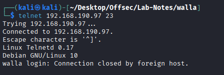
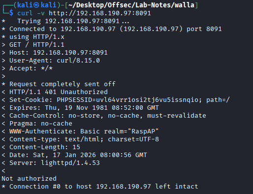
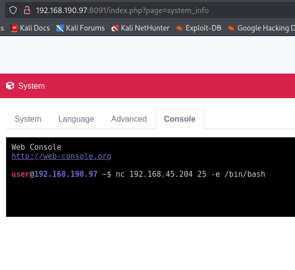
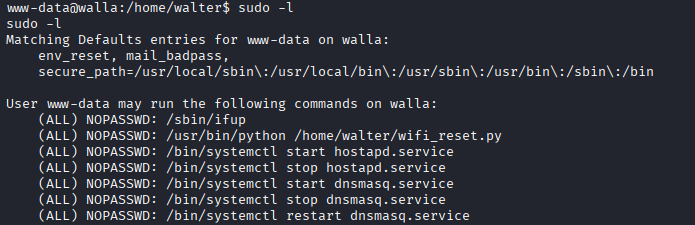
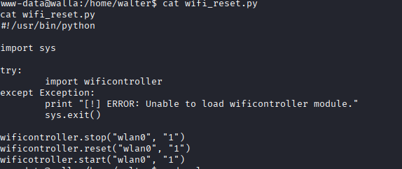
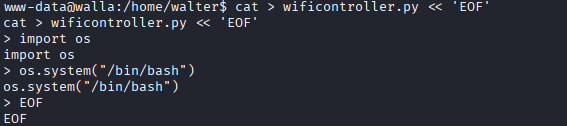
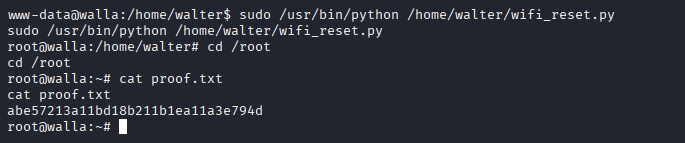

# Walla

* nmap
```
PORT      STATE    SERVICE    VERSION
22/tcp    open     ssh        OpenSSH 7.9p1 Debian 10+deb10u2 (protocol 2.0)
| ssh-hostkey: 
|   2048 02:71:5d:c8:b9:43:ba:6a:c8:ed:15:c5:6c:b2:f5:f9 (RSA)
|   256 f3:e5:10:d4:16:a9:9e:03:47:38:ba:ac:18:24:53:28 (ECDSA)
|_  256 02:4f:99:ec:85:6d:79:43:88:b2:b5:7c:f0:91:fe:74 (ED25519)
23/tcp    open     telnet     Linux telnetd
25/tcp    open     smtp       Postfix smtpd
| ssl-cert: Subject: commonName=walla
| Subject Alternative Name: DNS:walla
| Not valid before: 2020-09-17T18:26:36
|_Not valid after:  2030-09-15T18:26:36
|_ssl-date: TLS randomness does not represent time
|_smtp-commands: walla, PIPELINING, SIZE 10240000, VRFY, ETRN, STARTTLS, ENHANCEDSTATUSCODES, 8BITMIME, DSN, SMTPUTF8, CHUNKING
53/tcp    open     tcpwrapped
422/tcp   open     ssh        OpenSSH 7.9p1 Debian 10+deb10u2 (protocol 2.0)
| ssh-hostkey: 
|   2048 02:71:5d:c8:b9:43:ba:6a:c8:ed:15:c5:6c:b2:f5:f9 (RSA)
|   256 f3:e5:10:d4:16:a9:9e:03:47:38:ba:ac:18:24:53:28 (ECDSA)
|_  256 02:4f:99:ec:85:6d:79:43:88:b2:b5:7c:f0:91:fe:74 (ED25519)
1678/tcp  filtered prolink
8091/tcp  open     http       lighttpd 1.4.53
|_http-server-header: lighttpd/1.4.53
|_http-title: Site doesn't have a title (text/html; charset=UTF-8).
| http-cookie-flags: 
|   /: 
|     PHPSESSID: 
|_      httponly flag not set
| http-auth: 
| HTTP/1.1 401 Unauthorized\x0D
|_  Basic realm=RaspAP
18936/tcp filtered unknown
42042/tcp open     ssh        OpenSSH 7.9p1 Debian 10+deb10u2 (protocol 2.0)
| ssh-hostkey: 
|   2048 02:71:5d:c8:b9:43:ba:6a:c8:ed:15:c5:6c:b2:f5:f9 (RSA)
|   256 f3:e5:10:d4:16:a9:9e:03:47:38:ba:ac:18:24:53:28 (ECDSA)
|_  256 02:4f:99:ec:85:6d:79:43:88:b2:b5:7c:f0:91:fe:74 (ED25519)
```



* port 8091 -> authenticated



```
< WWW-Authenticate: Basic realm="RaspAP"
```

* RaspAP is wireless router software. Default creds- admin:secret.

* There is a console shell



* we get connection as www-data

* Priv-Esc








