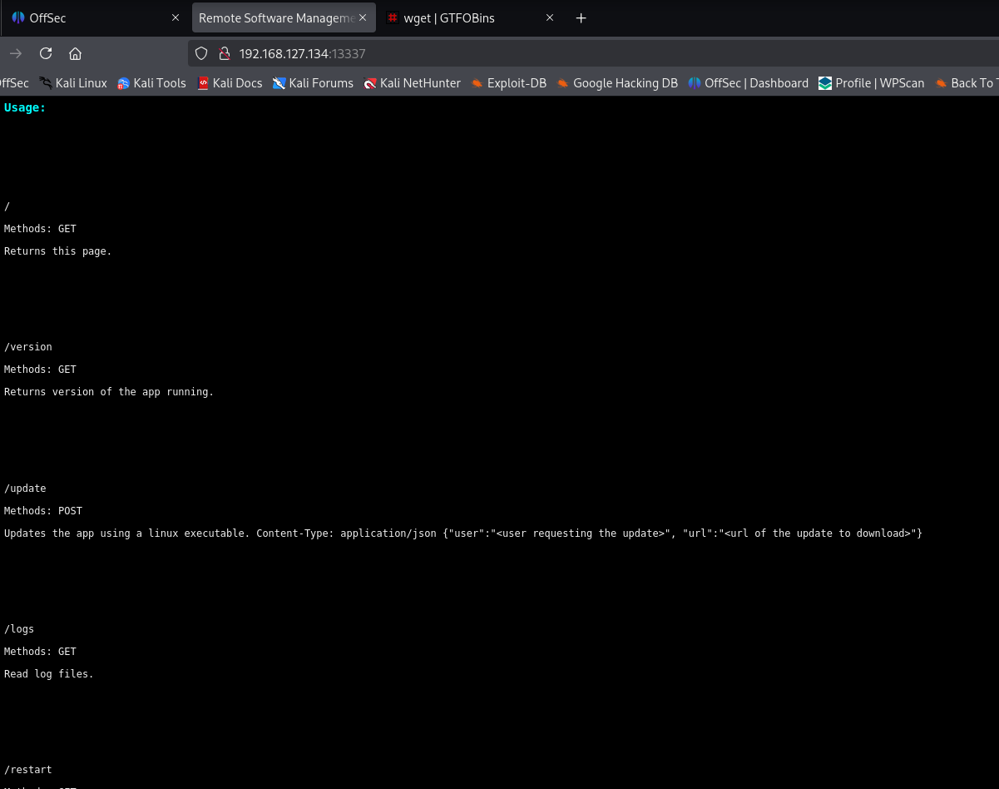
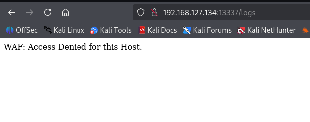
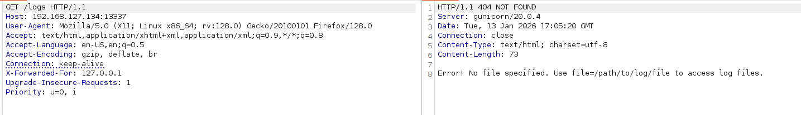
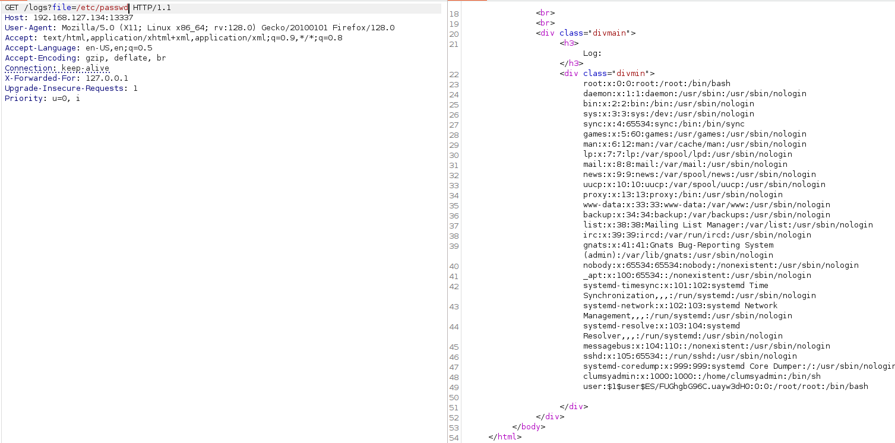
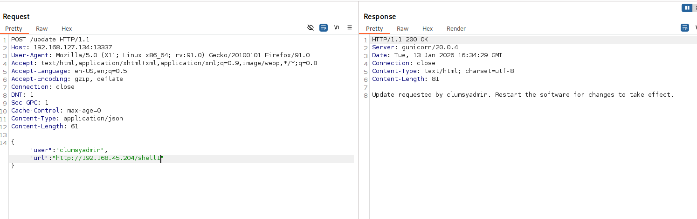
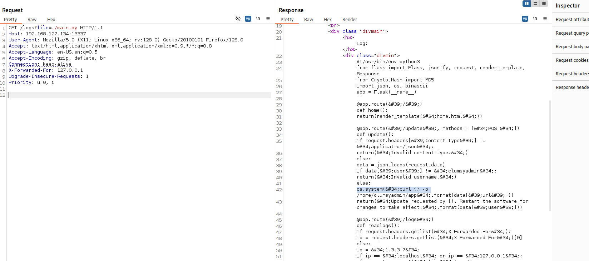
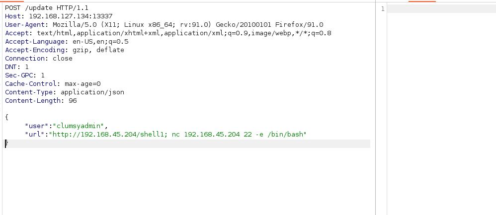
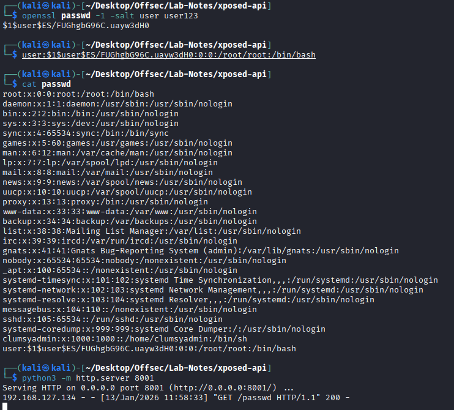
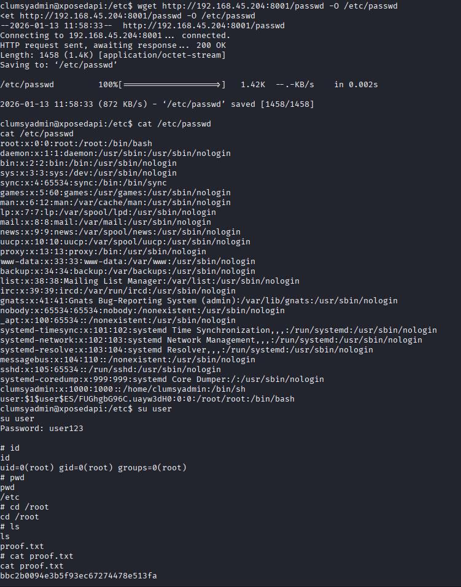

# Xposed-api

* nmap
```
PORT      STATE SERVICE VERSION
22/tcp    open  ssh     OpenSSH 7.9p1 Debian 10+deb10u2 (protocol 2.0)
| ssh-hostkey: 
|   2048 74:ba:20:23:89:92:62:02:9f:e7:3d:3b:83:d4:d9:6c (RSA)
|   256 54:8f:79:55:5a:b0:3a:69:5a:d5:72:39:64:fd:07:4e (ECDSA)
|_  256 7f:5d:10:27:62:ba:75:e9:bc:c8:4f:e2:72:87:d4:e2 (ED25519)
13337/tcp open  http    Gunicorn 20.0.4
|_http-server-header: gunicorn/20.0.4
|_http-title: Remote Software Management API
```
* Port 13337- Remote Software management API



* /logs is bloked by waf



* Able to bypass it by X-Forwarded-For



* Able to read /etc/passwd



```
/update

Methods: POST

Updates the app using a linux executable. Content-Type: application/json {"user":"<user requesting the update>", "url":"<url of the update to download>"}
```

* we got user clumsyadmin.

* create a linux elf reverse shell using msfvenom. Serve it and restart the app by /restart endpoint.



* we get a shell.

OR

* ./main.py reveals /update endpoint user python os.system call to download its update.





* PrivEsc -> setuid for wget 

* copy /etc/passwd file. Add a new root user. Use wget to overwrite it in vicyim machine. su user.




